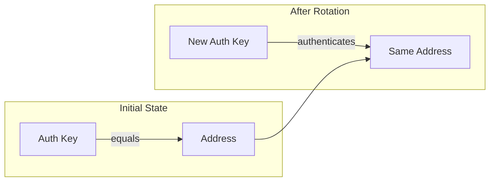
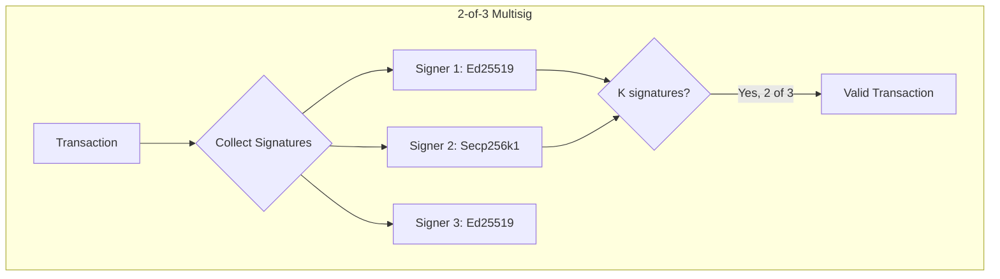
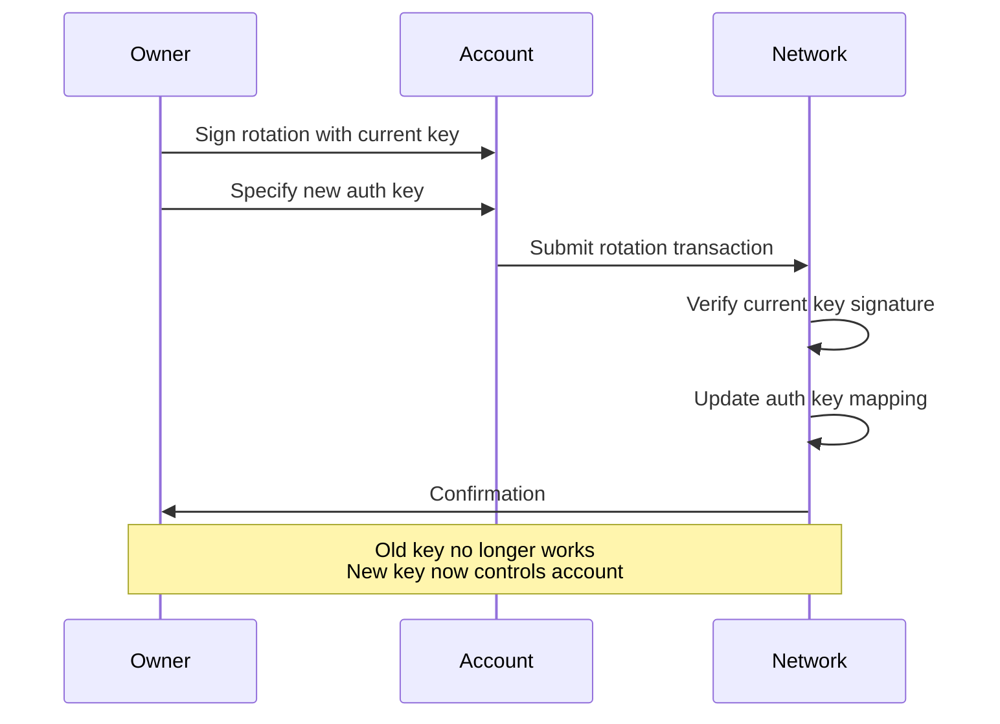

# Account Authentication

Authentication on Cedra is more flexible than most blockchains. The separation between address and authentication key means you can rotate your keys without changing your account identity - similar to changing a password without creating a new username. Cedra also supports multiple cryptographic schemes and native multisig, all built into the protocol rather than implemented through smart contracts.

:::tip Navigation
**Previous:** [Understanding Accounts](/concepts/accounts/understanding-accounts)
**You are here:** Authentication
**Next:** [Resources](/concepts/accounts/resources)
:::

### Authentication Key vs Address

When you first create an account, your authentication key becomes your address. But here's the key insight: while the address is permanent, the authentication key can change.

The authentication key is what proves you own the account - it's derived from your public key and verified when you sign transactions. If your private key is compromised or you simply want better security, you can rotate to a new authentication key while keeping your existing address, balances, and resources.



The network maintains an on-chain mapping that tracks these rotations, so it knows which authentication key currently controls each address.

## Authentication Schemes

Cedra supports multiple cryptographic schemes for signing transactions. Each scheme uses a different algorithm to derive the authentication key from the public key.

### Ed25519 (Default)

The most common choice, using the Ed25519 elliptic curve. The authentication key is computed as:

```
auth_key = sha3-256(public_key | 0x00)
```

The `0x00` suffix is the scheme identifier that distinguishes Ed25519 from other schemes. Ed25519 offers fast signature verification and is well-suited for most use cases.

### Secp256k1 ECDSA

The same curve used by Bitcoin and Ethereum. If you're migrating from those ecosystems or want compatibility with existing tooling, Secp256k1 is available:

```
auth_key = sha3-256(0x01 | public_key | 0x02)
```

### MultiEd25519 (K-of-N Multisig)

For accounts requiring multiple signatures, Cedra supports K-of-N multisig natively. You specify N public keys and require K of them to sign any transaction:

```
auth_key = sha3-256(pubkey_1 | pubkey_2 | ... | pubkey_n | K | 0x01)
```

For example, a 2-of-3 multisig would have three public keys concatenated, followed by the threshold value 2, then the scheme identifier.

## Native Multisig Support

Unlike Ethereum where multisig requires deploying a smart contract, Cedra's multisig is built into the protocol. This means:

- **Lower gas costs** - No contract deployment or extra execution overhead
- **Simpler setup** - Just combine public keys and set a threshold
- **Mixed key types** - Combine Ed25519, Secp256k1, WebAuthn in one multisig
- **No contract risk** - No smart contract bugs to worry about

A transaction from a multisig account includes multiple signatures. The network verifies that at least K of the N authorized keys have signed before accepting the transaction.




## Key Rotation

Key rotation lets you change the authentication key controlling your account while keeping the same address. This is essential for:

- **Compromised keys** - If you suspect your private key was exposed, rotate immediately
- **Security upgrades** - Move from a single key to multisig, or upgrade to a hardware wallet
- **Organizational changes** - When team members change, rotate the controlling keys

The rotation process uses the `account::rotate_authentication_key` function. You sign the rotation request with your current key to prove ownership, and specify the new authentication key that should take over.



After rotation, the old key can no longer sign transactions for this account. The address remains unchanged, so all your resources, module references, and history stay intact.

:::info Rotation Tracking
The network maintains an on-chain `OriginatingAddress` table that maps authentication keys to their original addresses. This ensures that even after multiple rotations, the account's identity remains consistent.
:::

## Next Steps

- [Resources](/concepts/accounts/resources) - How Move resources are stored within accounts
- [Understanding Accounts](/concepts/accounts/understanding-accounts) - Account fundamentals
- [Transactions](/concepts/transactions/understanding-transactions) - How authenticated accounts interact with the network
