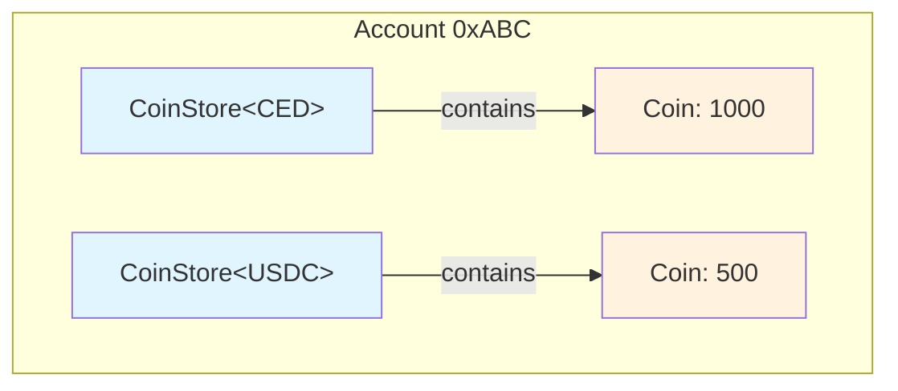
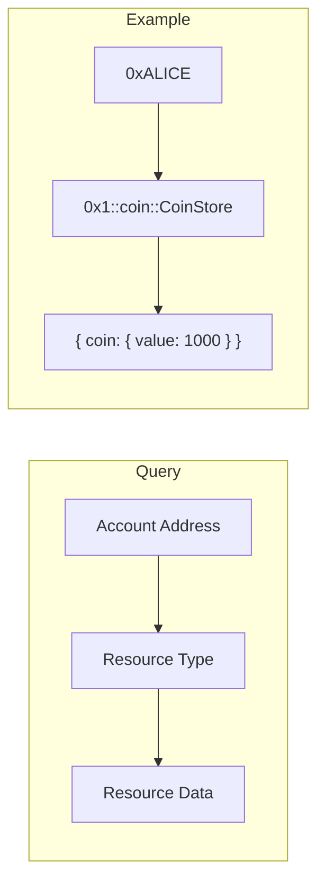
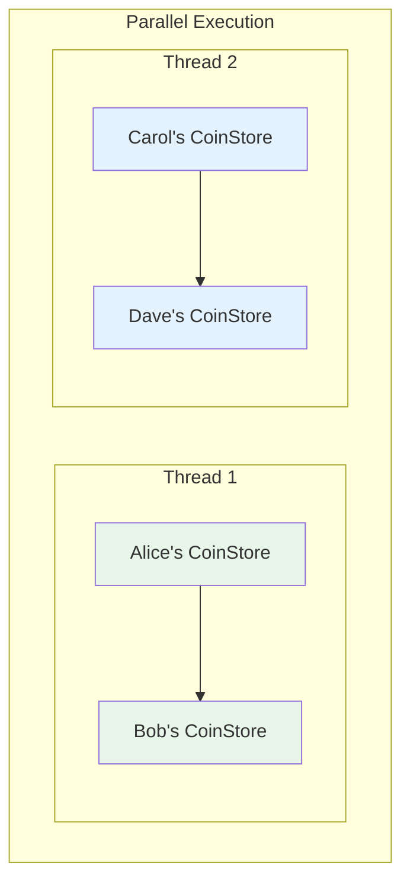

# Move Resources

On Cedra, all on-chain state is organized into resources and modules stored within accounts. This is fundamentally different from Ethereum's model where each smart contract maintains its own storage. In Cedra, your tokens live in your account, not in a contract's storage - and this per-account model is what enables parallel transaction execution.

:::tip Navigation
**Previous:** [Authentication](/concepts/accounts/authentication)
**You are here:** Resources
**Overview:** [Understanding Accounts](/concepts/accounts/understanding-accounts)
:::

## Resources vs Instances

Move distinguishes between two types of storable data based on their abilities.

A **resource** has the `key` ability, meaning it can be stored directly under an account address. Resources are top-level citizens - you can query them directly by account address and type.

An **instance** has the `store` ability, meaning it can be stored within other resources but not directly under an account. Instances are nested data that lives inside resources.

```move
module 0x1::coin {
    /// Resource - stored directly under account (has `key`)
    struct CoinStore<phantom CoinType> has key {
        coin: Coin<CoinType>,
    }

    /// Instance - stored within CoinStore (has `store`)
    struct Coin<phantom CoinType> has store {
        value: u64,
    }
}
```

In this example, `CoinStore` is the resource that lives under your account. It contains a `Coin` instance that holds the actual balance. You can't store a `Coin` directly under an account - it must be wrapped in something with the `key` ability.



## Defining Resources

When you define a resource, you're specifying its structure, abilities, and the module that governs it.

```move
module 0x1234::token {
    struct TokenStore has key {
        tokens: vector<Token>,
        frozen: bool,
    }

    struct Token has store, drop {
        id: u64,
        metadata: vector<u8>,
    }
}
```

The fully qualified path to this resource is `0x1234::token::TokenStore`. When you want to access it, you need three pieces of information:

- **Address**: `0x1234` - where the module is deployed
- **Module**: `token` - the module name
- **Resource**: `TokenStore` - the struct name with `key` ability

## Resource Permissions

The module that defines a resource controls all operations on it. This is Move's core security model - only the defining module can:

- Create new instances (`move_to`)
- Destroy instances (`move_from`)
- Borrow references (`borrow_global`, `borrow_global_mut`)

External modules and users can only interact with resources through the public functions that the defining module exposes. The internal state of a resource is completely protected.

```move
module 0x1::coin {
    struct Balance has key { value: u64 }

    /// Only this module can create balances
    public fun initialize(account: &signer) {
        move_to(account, Balance { value: 0 });
    }

    /// Only this module can modify balances
    public fun deposit(addr: address, amount: u64) acquires Balance {
        let balance = borrow_global_mut<Balance>(addr);
        balance.value = balance.value + amount;
    }

    /// External code can read but not modify
    public fun get_balance(addr: address): u64 acquires Balance {
        borrow_global<Balance>(addr).value
    }
}
```

This means "ownership" in Move is not just about where data is stored - it's about which module has permission to modify it. A token might be stored under your account, but only the token module's code can change its value.

## Storage Location

Resources live within the accounts that own them. When Alice holds CED tokens, the `CoinStore<CED>` resource is stored under Alice's address, not under some global contract address.

To query a resource, you need the owner's address plus the resource type:

```
Account: 0xALICE
Resource: 0x1::coin::CoinStore<0x1::ced::CED>
```

You can view resources through:
- The Cedra Explorer - enter any address to see its resources
- Fullnode REST API - `GET /accounts/{address}/resources`
- SDK calls - `client.getAccountResource(address, resourceType)`



## Parallel Execution Benefits

This per-account storage model is why Cedra can execute transactions in parallel. When Alice sends tokens to Bob while Carol sends tokens to Dave, these transactions touch completely different storage locations:

- Alice's transaction: reads/writes Alice's `CoinStore`, writes Bob's `CoinStore`
- Carol's transaction: reads/writes Carol's `CoinStore`, writes Dave's `CoinStore`

No overlap means no conflicts, so both transactions can execute simultaneously.



Compare this to Ethereum, where all ERC-20 transfers go through a single contract's storage. Every transfer must access the same contract state, creating a bottleneck that prevents parallel execution.

:::info Events and Receivers
Events can also be stored in the receiver's account rather than emitted globally. This further reduces contention - Alice receiving tokens triggers an event stored under Alice's account, not in some shared event log.
:::

## Working with Resources

Here's how you interact with resources in Move code:

```move
module 0x1::example {
    struct Counter has key {
        value: u64,
    }

    /// Create a new counter under the signer's account
    public fun create(account: &signer) {
        move_to(account, Counter { value: 0 });
    }

    /// Check if an account has a counter
    public fun exists_at(addr: address): bool {
        exists<Counter>(addr)
    }

    /// Read the counter value
    public fun get(addr: address): u64 acquires Counter {
        borrow_global<Counter>(addr).value
    }

    /// Increment the counter (requires signer for access control)
    public fun increment(account: &signer) acquires Counter {
        let addr = signer::address_of(account);
        let counter = borrow_global_mut<Counter>(addr);
        counter.value = counter.value + 1;
    }

    /// Remove and destroy the counter
    public fun destroy(account: &signer) acquires Counter {
        let addr = signer::address_of(account);
        let Counter { value: _ } = move_from<Counter>(addr);
    }
}
```

The `acquires` annotation tells the compiler which resources a function accesses. This enables compile-time checking and helps with parallel execution planning.

## Next Steps

- [Understanding Accounts](/concepts/accounts/understanding-accounts) - Account fundamentals and types
- [Authentication](/concepts/accounts/authentication) - How accounts prove ownership
- [Move Resource Types](/move/resource) - Deep dive into resource programming
- [Block-STM](/concepts/block-stm) - How per-account storage enables parallel execution
