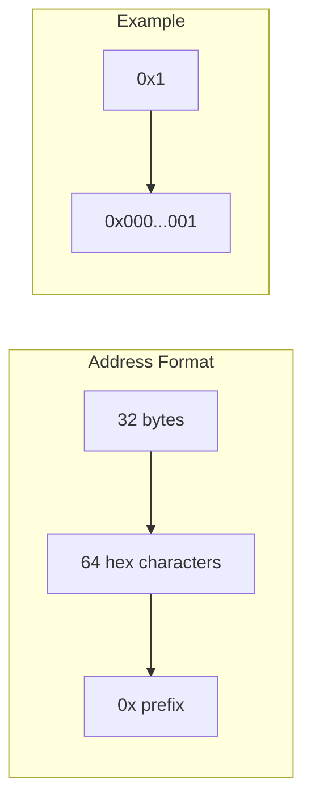
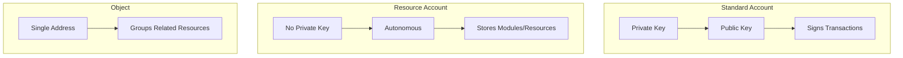
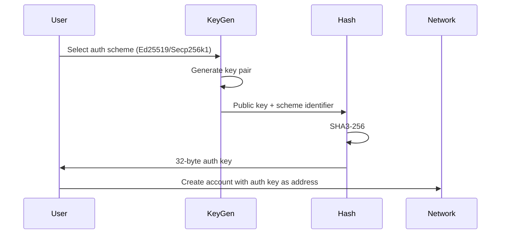

# Understanding Accounts

Accounts on Cedra represent access control over assets stored as Move resources. Unlike Ethereum where accounts exist implicitly once someone sends funds to an address, Cedra requires explicit account creation before any transactions can be executed. This design enables powerful features like key rotation and native multisig support.

:::tip Navigation
**You are here:** Understanding Accounts
**Next:** [Authentication](/concepts/accounts/authentication) | [Resources](/concepts/accounts/resources)
**Overview:** [Blockchain Architecture](/concepts/blockchain)
:::


### Account Addresses

Every account is identified by a 32-byte address, displayed as a 64-character hexadecimal string prefixed with `0x`. When you see short addresses like `0x1` for framework modules, they're simply padded with leading zeros - `0x1` becomes `0x0000000000000000000000000000000000000000000000000000000000000001`.



The address is permanent and never changes, even when authentication keys are rotated. Think of it as your unchanging identifier on the network, similar to a username that stays constant even when you change your password.


## Account Types

Cedra supports three distinct account types, each serving different purposes.

### Standard Accounts

The most common account type, controlled by a public/private key pair. When you create a wallet, you're creating a standard account. You sign transactions with your private key, and the network verifies them against your public key.

### Resource Accounts

These are autonomous accounts with no private key - nobody can sign transactions on their behalf. Developers use resource accounts to store modules and resources that need to exist independently of any user. For example, a DEX might deploy its liquidity pool logic to a resource account so the code persists regardless of the original deployer.

### Objects

Objects represent complex assets at a single address, useful when you need to group related resources together. Unlike standard accounts, objects are designed to represent single entities like NFTs or complex on-chain structures.




## Creating an Account

Account creation follows a deterministic process that derives the address from your chosen authentication scheme.

First, you select an authentication scheme - either Ed25519 (the default and most common) or Secp256k1 ECDSA. Then you generate a key pair for that scheme. From the public key, you derive a 32-byte authentication key using a hash function. This authentication key becomes your initial account address.



The relationship between authentication key and address is what enables key rotation - you can change your auth key later while keeping the same address.


## Sequence Numbers

Every account maintains a sequence number that acts as a transaction counter. When you submit a transaction, it must include your current sequence number. After successful execution, the sequence number increments by one.

This mechanism serves a critical security purpose: replay protection. Without sequence numbers, an attacker could capture a valid signed transaction and submit it repeatedly. With sequence numbers, each transaction is valid exactly once - the second attempt would fail because the sequence number would no longer match.

:::info Multi-Agent Transactions
In transactions involving multiple signers, only the primary signer's sequence number is checked and incremented. Secondary signers don't need to worry about sequence number coordination.
:::


## Account State

Each account can hold two types of on-chain data: Move modules and Move resources.

**Modules** are compiled smart contract code. When you deploy a Move package, the bytecode is stored as modules under your account. Other accounts can then call functions from these modules.

**Resources** are structured data that follows Move's ownership rules. Your CED balance, NFT collections, and any other on-chain assets exist as resources stored within your account.

An account can hold an arbitrary number of both modules and resources. This per-account storage model is fundamentally different from Ethereum's contract-centric approach, and it's what enables Cedra's parallel execution - transactions touching different accounts can run simultaneously without conflicts.


## Access Control with Signers

Move uses the `signer` type to implement access control. When a function requires a `signer` parameter, only the account owner can call it - they must sign the transaction to prove ownership.

```move
module 0x1::coin {
    /// Only the account owner can withdraw from their balance
    public fun withdraw(account: &signer, amount: u64): Coin {
        // signer proves ownership of the account
        let balance = borrow_global_mut<Balance>(signer::address_of(account));
        // ... withdraw logic
    }

    /// Anyone can check a balance - no signer required
    public fun balance(addr: address): u64 {
        borrow_global<Balance>(addr).value
    }
}
```

Functions without a `signer` parameter are open to anyone. In the example above, `withdraw` requires the account owner's signature, but `balance` can be called by anyone to view any account's balance. This pattern - signer for writes, address for reads - appears throughout Move development.


## Next Steps

- [Authentication](/concepts/accounts/authentication) - Learn about auth schemes, multisig, and key rotation
- [Resources](/concepts/accounts/resources) - Understand how Move resources are stored and accessed
- [Transactions](/concepts/transactions/understanding-transactions) - See how accounts interact with the network
