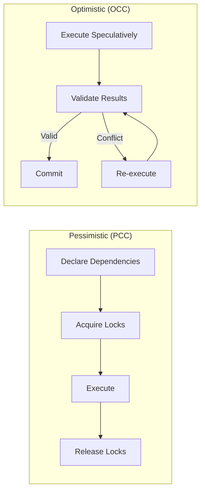
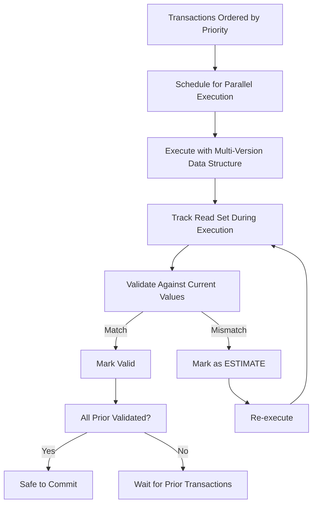
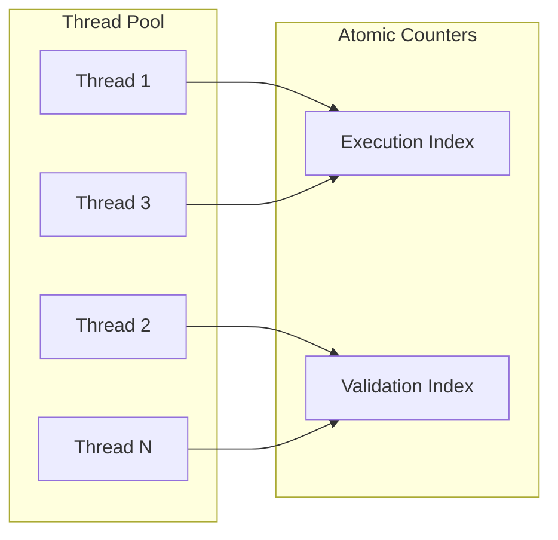
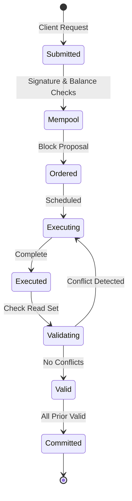

# Block-STM: Parallel Execution Engine

Cedra achieves high throughput through Block-STM, a parallel execution engine that processes transactions concurrently while maintaining deterministic results. This technology enables over 160,000 transactions per second by combining Software Transactional Memory techniques with a novel collaborative scheduler.

### Key Concepts

- **[Parallel Execution](#how-block-stm-works)**: Running multiple transactions simultaneously
- **[Optimistic Concurrency Control](#optimistic-vs-pessimistic-concurrency)**: Execute first, validate later
- **[Multi-version Data Structure](#multi-version-data-structure)**: Track all writes with versions
- **[Collaborative Scheduler](#the-collaborative-scheduler)**: Coordinate tasks across threads

---

## The Concurrency Challenge

Smart contract execution is a major throughput bottleneck for blockchains. After proposing blocks and agreeing on their order, validators must execute the transactions and arrive at the same final state - one that corresponds to some sequential execution. This creates a fundamental tension: we want parallel execution for speed, but we need deterministic results for consensus.

:::info Core Principle
Block-STM guarantees that parallel execution produces the same result as if transactions were executed sequentially in the preset order. This determinism is essential - validators executing the same block must arrive at identical final states.
:::

Current blockchains face a difficult choice: execute sequentially (which doesn't scale) or require an embarrassingly parallel workload with no conflicts (which is unrealistic for real applications). Transactions often have significant access conflicts due to popular contracts, economic opportunities like auctions and arbitrage, or even performance attacks.

Block-STM solves this by dynamically and transparently extracting the inherent parallelism from any workload, without requiring users to declare dependencies upfront.

---

## Optimistic vs Pessimistic Concurrency

There are two fundamental approaches to handling concurrent access to shared resources:

### Pessimistic Concurrency Control (PCC)

In PCC systems like Solana, transactions are blocked if they need to access a resource already in use by another transaction. This approach requires transactions to declare upfront what portions of memory they will read from and write to, since acquiring locks on the fly leads to unserializable execution results.

While PCC has historically performed well in distributed databases, it comes with significant limitations: users must specify all dependencies before execution, which constrains what transactions can do and may require complex transactions to be broken up or retried.

### Optimistic Concurrency Control (OCC)

Block-STM uses OCC, where transactions execute on all available processing resources with no regard for conflicts. Instead of writing directly to persistent memory, transactions write to a log. After execution, each transaction is validated to ensure it didn't violate database integrity rules. If validation fails, the transaction is rolled back and rescheduled; otherwise, it commits.

| Aspect | PCC (Solana) | OCC (Block-STM) |
|--------|--------------|-----------------|
| **Dependency Declaration** | Required upfront | Not required |
| **Execution** | Blocked if resource locked | Proceeds optimistically |
| **Conflict Detection** | Before execution | After execution |
| **Developer Experience** | Must specify all accessed accounts | Transparent, automatic |
| **Arbitrary Logic** | Limited by declarations | Fully supported |

Thanks to clever design and engineering, Block-STM performs surprisingly well, with the added benefits of allowing arbitrary logic and a superior developer experience.

---

## How Block-STM Works

Block-STM combines known techniques with novel ideas to achieve high-performance parallel execution:

### Transaction Ordering

Before execution begins, transactions are ordered by priority: `tx₁ > tx₂ > tx₃ > ... > txₙ`. This preset order is crucial - it reduces the amount of synchronization required during execution. Where a general-purpose STM would need to solve consensus when conflicts occur, Block-STM simply follows the predetermined order: if tx₅ and tx₉ conflict, tx₉ waits for tx₅.

### Multi-Version Data Structure

Block-STM uses a multi-version data structure to avoid write-write conflicts. All writes to the same location are stored along with their versions, which contain:
- The transaction ID
- The number of times the writing transaction was re-executed

When a transaction `txⱼ` reads a memory location, it obtains the value written by the highest-priority transaction that appears before `txⱼ` in the preset order, along with the associated version.

### Read Set Tracking

During execution, each transaction records its read set - the memory locations and associated values it read. This information is essential for validation.

### Validation Process

After a transaction completes execution, it's validated by comparing its read set with the current values at those memory locations:

- **If values match**: The transaction is marked valid (but not yet safe to commit)
- **If values differ**: A higher-priority transaction modified a location that this transaction read, making the results invalid

### Conflict Resolution with ESTIMATE

When validation fails, instead of deleting dirty values from the data structure, Block-STM marks them as `ESTIMATE` and schedules the transaction for re-execution. This is a key optimization:

- Values aren't deleted because re-execution will likely write to the same locations
- Any lower-priority transaction that reads an `ESTIMATE` value waits for the dependency to be resolved
- This prevents a cascade of aborts and wasted work

---

## The Collaborative Scheduler

The collaborative scheduler is the performance-critical core of Block-STM. It coordinates validation and execution tasks among threads with minimal synchronization overhead.

A naive approach would use priority queues to track execution and validation tasks, but concurrent ordered sets are notoriously challenging to scale. Block-STM sidesteps this by using atomic counters that track a lower bound index for transactions needing execution or validation.

Threads repeatedly:
1. Fetch-and-increment the counter with the lower index
2. Check the transaction's status
3. Execute or validate if the transaction is ready

The fetch-and-increment naturally disperses threads to different indices, preventing contention on status information.

### Avoiding Cascading Aborts

When a transaction fails validation, its write set marks all its writes as `ESTIMATE` in the multi-version data structure. When another transaction reads an `ESTIMATE` value, it waits for the dependency to be resolved rather than proceeding blindly.

This is more efficient than pre-executing all transactions from the initial state because:
- Estimates are generated only when needed
- Estimates are based on a state much fresher than the block's beginning

---

## Transaction Lifecycle in Block-STM

1. **Submission**: Client sends transaction to a fullnode or validator
2. **Mempool**: Nodes verify signatures, minimum balances, and sequence numbers for replay protection
3. **Block Proposal**: Leader selects transactions and proposes an ordering
4. **Parallel Execution**: Transactions execute concurrently on available threads
5. **Validation**: Each transaction's read set is compared against current values
6. **Re-execution**: Invalid transactions are rescheduled with `ESTIMATE` markers
7. **Commitment**: Once all prior transactions are valid, the block commits

A transaction is not safe to commit until all transactions before it in the preset order have been executed and validated - a failed validation of an earlier transaction requires revalidation of all later ones.

---

## Performance Characteristics

Block-STM achieves remarkable performance by dynamically adapting to workload characteristics:

:::info Performance Results
With 32 threads processing 10,000 peer-to-peer Move transactions (8 reads, 5 writes each):
- **Low contention**: 16x speedup over sequential execution
- **High contention**: 8x speedup over sequential execution
- **Sequential workload**: Minimal overhead
:::

The system automatically extracts available parallelism without hints from users. Under low contention, it approaches the theoretical maximum speedup. Under high contention, it gracefully degrades while still providing substantial improvements over sequential execution.

Importantly, when the workload is inherently sequential (worst case), Block-STM incurs only small overhead compared to sequential execution.

---

## Why This Matters for Developers

Block-STM provides transparent parallel execution - developers write smart contracts without worrying about concurrency:

**No Dependency Declarations**: Unlike systems that require upfront specification of accessed accounts, Block-STM handles everything automatically. Write your logic; the system figures out the rest.

**Arbitrary Logic Supported**: Because dependencies are discovered at runtime, transactions can contain complex, conditional logic that accesses different resources based on state.

**Better User Experience**: Users don't need to structure their transactions around parallelization requirements or retry failed transactions due to incorrect dependency specifications.

**Consistent Results**: Despite parallel execution, the results are guaranteed to match sequential execution in the preset order - perfect for blockchain's determinism requirements.

---

## Summary

Block-STM is Cedra's parallel execution engine that achieves high throughput without sacrificing developer experience or flexibility:

- **Optimistic execution** proceeds without waiting for locks, validating afterward
- **Multi-version data structures** track all writes with versions for conflict detection
- **ESTIMATE markers** prevent cascading aborts when conflicts are detected
- **Collaborative scheduling** with atomic counters minimizes synchronization overhead
- **Preset ordering** simplifies conflict resolution and guarantees determinism
- **Transparent operation** requires no dependency declarations from developers

The result: over 160,000 transactions per second with the flexibility to support arbitrary smart contract logic.

---

## Learn More

- [Blockchain Architecture](/concepts/blockchain) - Overall system design
- [Understanding Transactions](/concepts/transactions/understanding-transactions) - Transaction structure and lifecycle
- [States and Transitions](/concepts/transactions/states) - How state evolves
