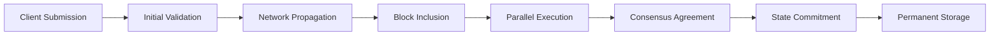
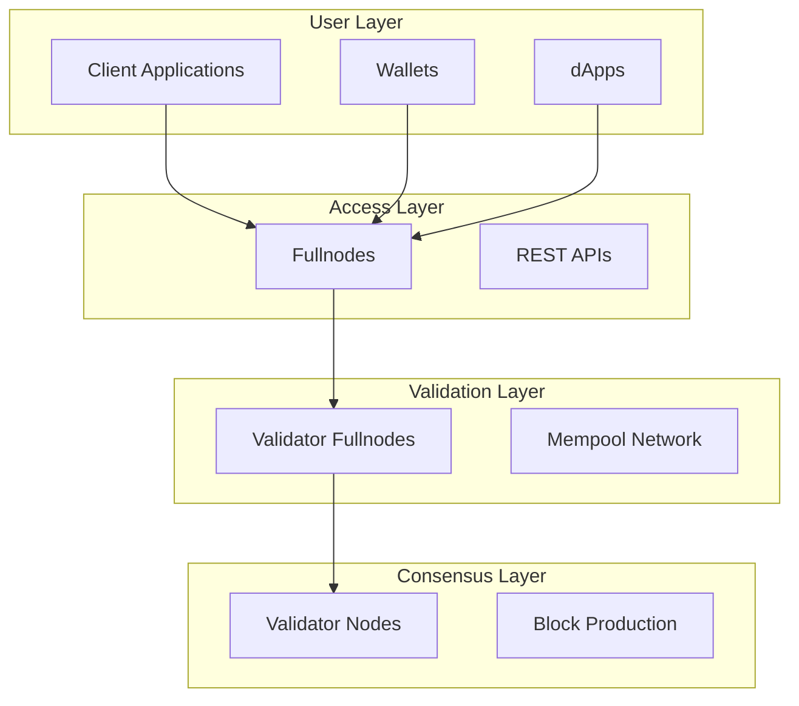
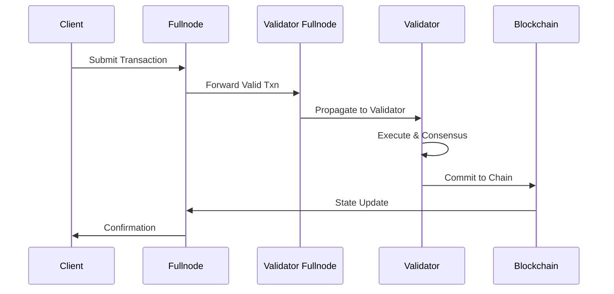
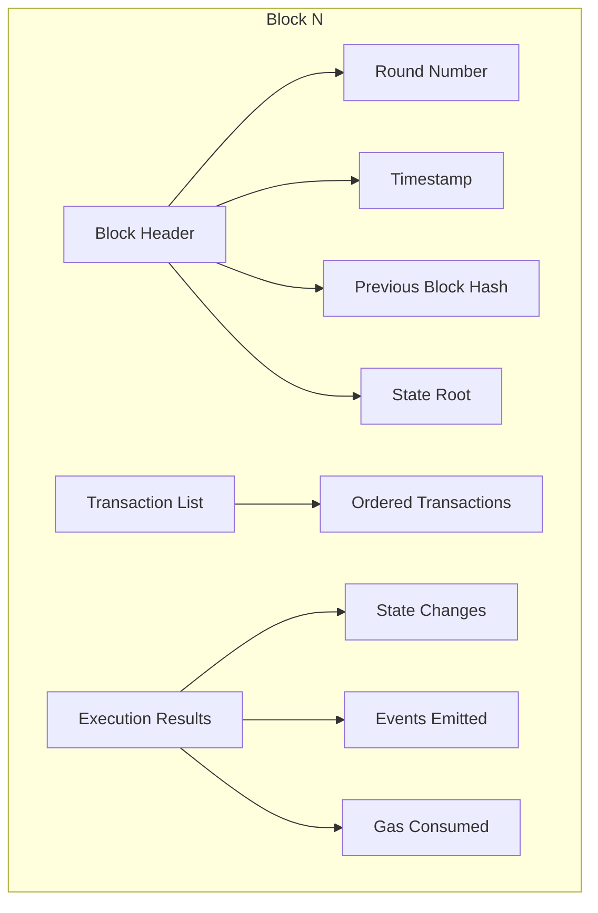
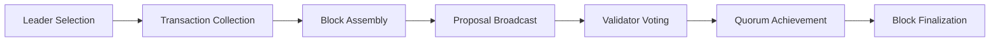

# Cedra Blockchain Deep Dive

Cedra is a high-performance blockchain built on Move language technology, designed for parallel transaction execution and instant finality. The network employs Byzantine Fault Tolerant consensus and sophisticated state management to achieve thousands of transactions per second while maintaining security and decentralization.

### Key Concepts

Before diving deeper, let's establish the fundamental concepts:

- **[Accounts](/concepts/accounts/understanding-accounts)**: Entities that hold assets and can submit transactions
- **[Transactions](/concepts/transactions/understanding-transactions)**: Atomic operations that change the blockchain state
- **Blocks**: Containers that group multiple transactions for processing
- **Validators**: Network participants that execute transactions and reach consensus
- **[State](/concepts/transactions/states)**: The current snapshot of all accounts and resources on the blockchain
- **Finality**: The point at which a transaction becomes irreversible

---

## Transaction Lifecycle Overview

Every transaction on Cedra follows a predictable path through multiple validation and processing stages before becoming permanent:

### Processing Stages

#### Submission Stage
When a user initiates a transaction, their client application constructs a properly formatted transaction containing the sender's address, the operation to perform, gas parameters, and a cryptographic signature. This transaction enters the network through a REST API endpoint.

#### Validation Stage
The network performs multiple validation checks:
- Structural integrity of the transaction format
- Cryptographic signature verification
- Account existence and authentication
- Sequence number validation for replay protection
- Sufficient balance for gas fees

#### Propagation Stage
Valid transactions spread across the network through a gossip protocol. Each validator maintains a mempool (memory pool) where pending transactions await processing. Validators share their transactions with peers, ensuring network-wide visibility.

#### Inclusion Stage
Validators take turns acting as block proposers. The current leader selects transactions from the mempool, prioritizing by gas price and other factors, and forms them into a proposed block.

#### Execution Stage
Cedra employs parallel execution through [Block-STM](/concepts/block-stm) technology. Multiple transactions execute simultaneously with optimistic concurrency control. The system tracks read and write operations, detecting and resolving conflicts automatically.

#### Commitment Stage
After execution, validators must agree on the results. Once consensus is reached with a quorum of validators, the block and its effects become permanent. The state changes are applied, and the transactions are irreversibly committed to the blockchain.

### State Transitions

Transactions progress through distinct states during their lifecycle:

:::info Transaction States
- **Pending**: Submitted and awaiting processing
- **Validated**: Passed initial checks
- **Included**: Selected for a block
- **Executed**: Processed by the execution engine
- **Committed**: Permanently recorded on-chain
- **Rejected**: Failed validation or execution
:::

### Transaction Example

Consider Alice sending 10 CED to Bob:

1. Alice's wallet creates and signs the transaction
2. The transaction enters through a fullnode's REST API
3. Initial validation confirms Alice has sufficient balance
4. The transaction spreads to validators via the mempool network
5. A validator includes it in the next block
6. Parallel execution transfers the funds
7. Validators reach consensus on the new state
8. The transfer becomes permanent and irreversible

---

## Network Architecture

The Cedra network operates through a hierarchy of specialized nodes, each serving specific functions in transaction processing:

#### Client Applications
End-user interfaces including wallets, dApps, and developer tools. These applications construct transactions and submit them to the network, then query for results.

#### Fullnodes
Public access points to the blockchain. Fullnodes provide REST API services, validate incoming transactions, forward them to validators, and serve blockchain queries. They maintain a complete copy of the blockchain state but don't participate in consensus.

#### Validator Fullnodes
Bridge nodes between the public network and validators. They handle mempool synchronization, ensure transaction propagation, and protect validators from direct public exposure.

#### Validator Nodes
The core consensus participants. Validators execute transactions, produce blocks, vote on proposals, and maintain the authoritative blockchain state.

### Network Topology

From the blockchain's perspective, the network forms concentric layers of trust and responsibility:

**Public Layer**: Open access for anyone to submit transactions and query state. This layer handles user interaction and provides network entry points.

**Propagation Layer**: Controlled distribution of transactions between nodes. Validators share pending transactions, ensuring all participants have access to the same transaction pool.

**Consensus Layer**: Restricted to validators only. Here, blocks are proposed, executed, and finalized through Byzantine Fault Tolerant consensus.

### Communication Protocols

Different layers use appropriate communication methods:

- **Client-to-Fullnode**: REST/JSON APIs for simplicity and compatibility
- **Node-to-Node**: Binary protocols for efficiency
- **Validator-to-Validator**: Authenticated, encrypted channels for security

### Data Flow Patterns

Understanding how data moves through the network from the blockchain's perspective:

The blockchain sees each transaction flow through increasingly restrictive validation layers, ensuring only valid, agreed-upon transactions become permanent.

---

## Block Formation

### Block Structure

Blocks serve as the fundamental organizing unit for transactions on the Cedra blockchain. Each block contains:

The block header provides metadata linking this block to the chain history and proving its validity. The transaction list contains the ordered set of operations to perform. Execution results capture the effects of processing these transactions.

### Transaction Selection

When forming a block, the blockchain must decide which pending transactions to include. This selection process balances multiple factors:

**Priority Mechanisms**: Transactions offering higher gas prices receive preference, creating an economic incentive for timely processing.

**Ordering Constraints**: Some transactions must execute in specific sequences. For example, transactions from the same account must respect sequence number ordering.

**Resource Limits**: Each block has maximum capacity constraints for computation, storage operations, and total size.

**Fairness Considerations**: The selection algorithm prevents any single account or application from monopolizing block space.

### Block Proposal Process

The blockchain uses a rotating leader system for block proposals:

Each round, a designated validator becomes the leader responsible for proposing the next block. The leader:

1. Collects available transactions from the mempool
2. Orders them according to priority and dependencies
3. Constructs a valid block within resource limits
4. Broadcasts the proposal to all validators

### Block Validation

Before accepting a proposed block, the blockchain performs comprehensive validation:

**Structural Validation**: Ensuring the block format is correct, all required fields are present, and the block links properly to the chain history.

**Transaction Validation**: Verifying each included transaction is valid, properly signed, and hasn't been processed before.

**Execution Validation**: Running all transactions to verify the proposed state changes are correct and checking that resource limits aren't exceeded.

**Consensus Validation**: Confirming sufficient validators agree on the block's validity and execution results.

Only after passing all validation does a block become part of the permanent blockchain, and its transactions achieve finality.

---

## Summary

Key architectural decisions enable Cedra's performance:
- Layered network architecture separates concerns and protects validators
- Parallel execution through [Block-STM](/concepts/block-stm) maximizes throughput
- BFT consensus ensures agreement without lengthy confirmation periods
- Sophisticated state management enables efficient verification

This design allows Cedra to process thousands of transactions per second while maintaining the security and decentralization essential to blockchain technology.

---

## Deep Dive Topics

For detailed technical understanding of specific components:

### Transaction System
- **[Understanding Transactions](/concepts/transactions/understanding-transactions)** - Complete guide to transaction anatomy, types, and lifecycle
- **[States and State Transitions](/concepts/transactions/states)** - How the blockchain state evolves through transactions
- **[Proofs and Verification](/concepts/transactions/proofs-and-verification)** - Cryptographic proofs enabling trustless verification

### Accounts
- **[Understanding Accounts](/concepts/accounts/understanding-accounts)** - Account addresses, types, and access control
- **[Authentication](/concepts/accounts/authentication)** - Auth schemes, multisig, and key rotation
- **[Resources](/concepts/accounts/resources)** - How Move resources enable per-account storage

### Execution
- **[Block-STM Parallel Execution](/concepts/block-stm)** - How Cedra achieves 160k+ TPS through optimistic concurrency