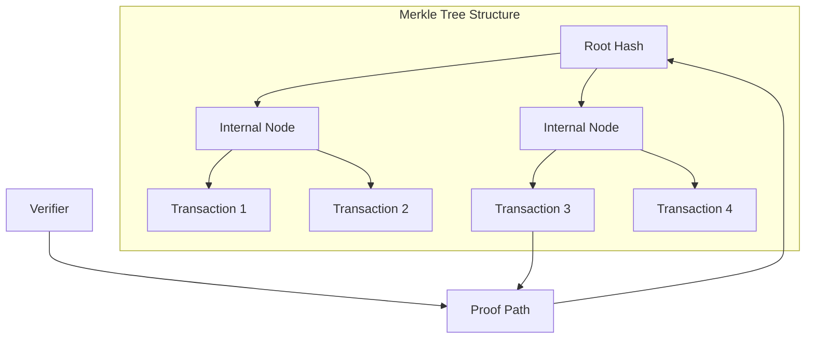
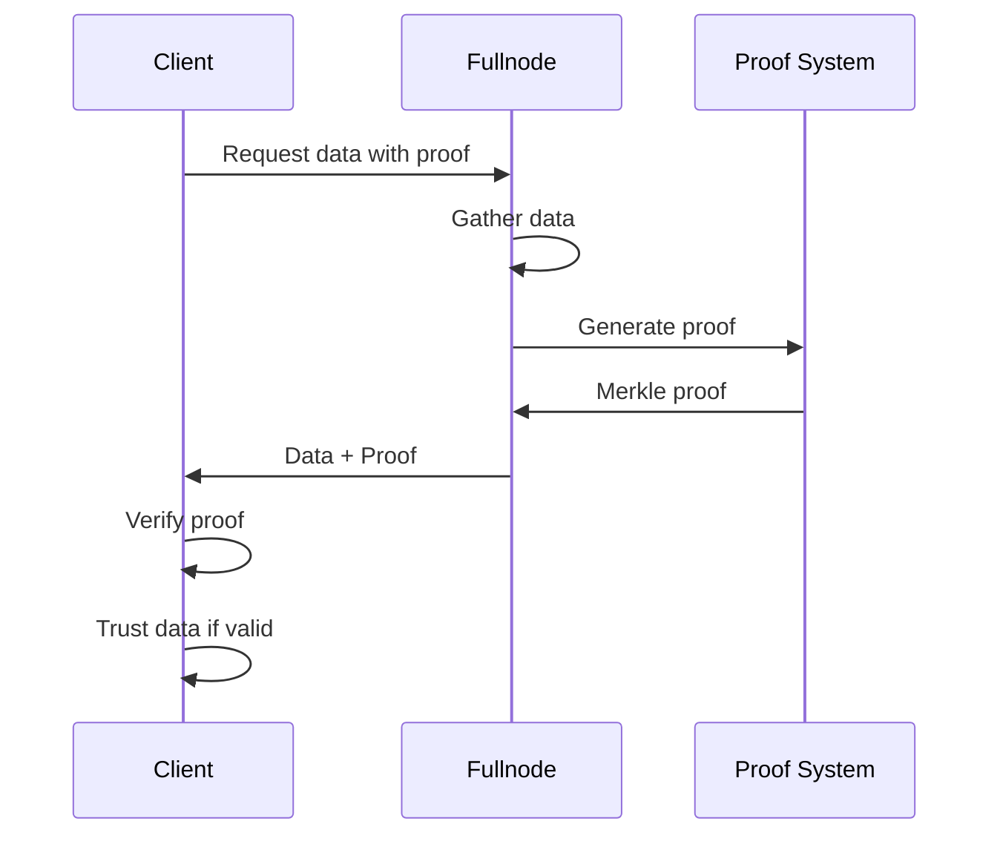
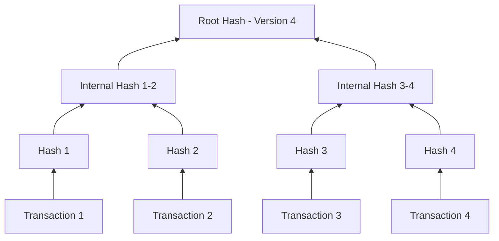

# Proofs and Verification

## Cryptographic Proofs

Cedra employs sophisticated cryptographic proofs to ensure data integrity and enable trustless verification:

## Proof Types

**Transaction Inclusion Proof**: Proves a specific transaction exists in the blockchain at a particular version.

**State Proof**: Verifies the current value of any account or resource without trusting the data provider.

**Event Proof**: Confirms that specific events were emitted during transaction execution.

## Verification Process

The verification process allows clients to independently verify blockchain data:

## Trust Model

With cryptographic proofs, clients can:
- Verify data without trusting the fullnode
- Detect any tampering or omission
- Ensure consistency across different data providers
- Maintain security even with untrusted intermediaries

## Merkle Accumulator

The blockchain maintains an ever-growing Merkle tree where each leaf represents a transaction:

Each new transaction adds a leaf, and the root hash provides a succinct commitment to the entire transaction history.

## Summary

Cedra's transaction and state system provides a robust foundation for blockchain operations:

- **Transactions** are carefully structured with authentication, execution, and ordering components
- **States** evolve deterministically through transaction application
- **Cryptographic proofs** enable trustless verification of all blockchain data

This architecture ensures that every state change is authorized, verifiable, and permanent, providing the security and reliability essential for a production blockchain system.