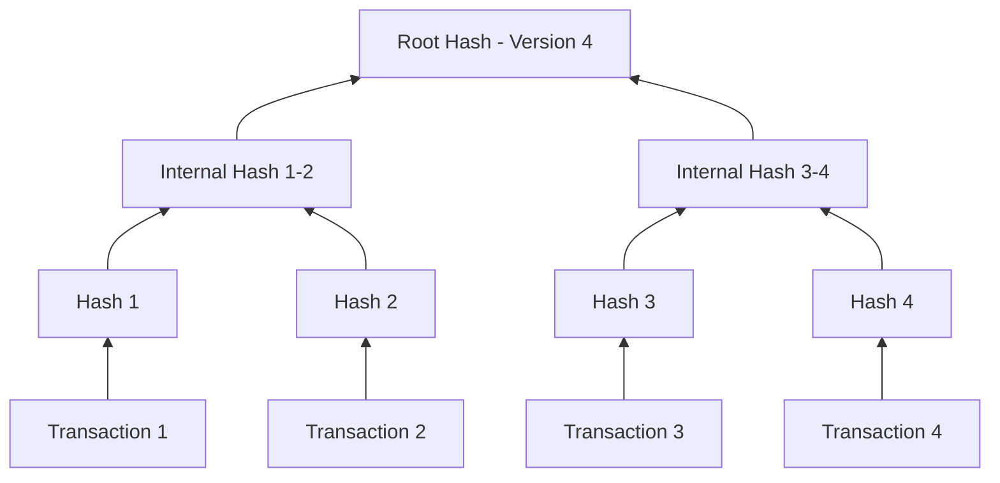
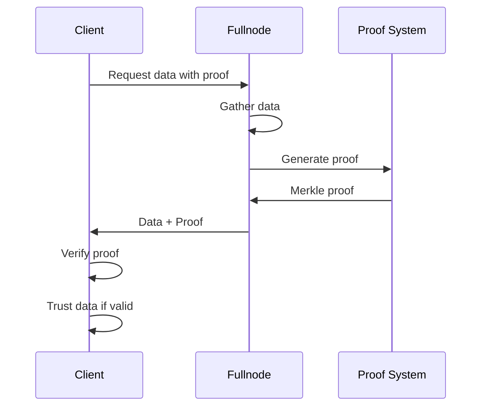

# Proofs and Verification

:::tip Navigation
**⬅️ Previous:** [States](/concepts/transactions/states)
**📍 You are here:** Proofs and Verification
**🏠 Overview:** [Blockchain Architecture](/concepts/blockchain)
**📚 Start:** [Understanding Transactions](/concepts/transactions/understanding-transactions)
:::

Cedra employs sophisticated cryptographic proofs to ensure data integrity and enable trustless verification using Merkle Tree Structure. These proofs are essential for verifying the [state transitions](/concepts/transactions/states) created by transactions without trusting intermediaries.

Each new transaction adds a leaf, and the root hash provides a succinct commitment to the entire transaction history.

### Proof Types

**Transaction Inclusion Proof**: Proves a specific transaction exists in the blockchain at a particular version.

**State Proof**: Verifies the current value of any account or resource without trusting the data provider.

**Event Proof**: Confirms that specific events were emitted during transaction execution.

### Verification Process

The verification process allows clients to independently verify blockchain data:

## Trust Model

With cryptographic proofs, clients can:
- Verify data without trusting the fullnode
- Detect any tampering or omission
- Ensure consistency across different data providers
- Maintain security even with untrusted intermediaries

This architecture ensures that every state change is authorized, verifiable, and permanent, providing the security and reliability essential for a production blockchain system.

---

## Learn More

Complete your understanding of Cedra's transaction and blockchain systems:

### Transaction System Deep Dives
- **[Understanding Transactions](/concepts/transactions/understanding-transactions)** - Start here to understand transaction fundamentals
- **[States and State Transitions](/concepts/transactions/states)** - How transactions modify blockchain state
- **[Blockchain Architecture](/concepts/blockchain)** - Overall network design and consensus

### Practical Guides
- **[Your First Transaction](/getting-started/tx)** - Hands-on transaction tutorial
- **[Network Resources](/network-resources)** - Endpoints and tools for working with transactions