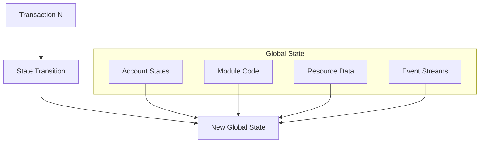
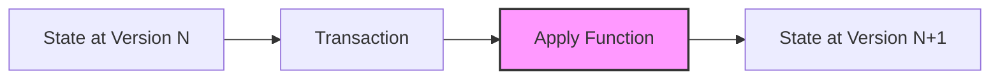
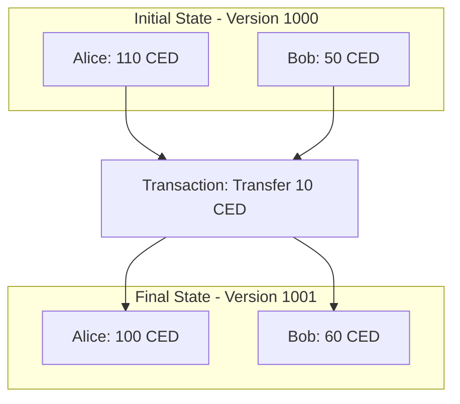
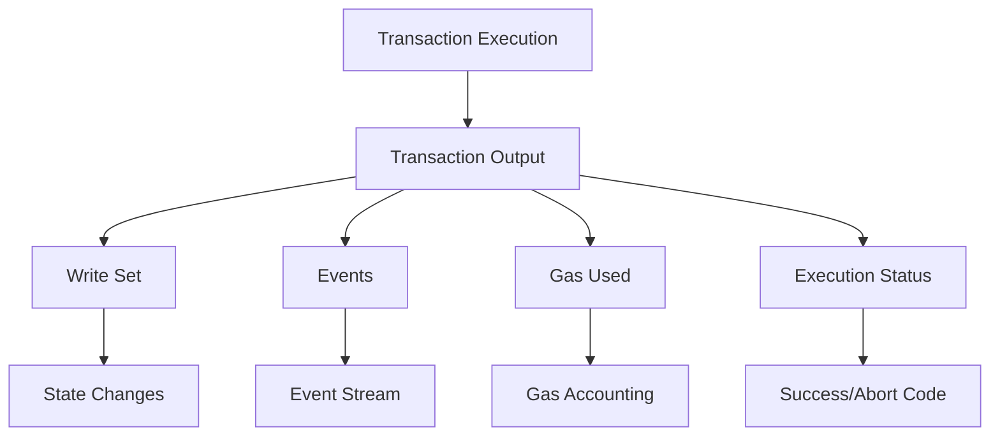

# States
// TODO: end here
## The Ledger State

The Cedra blockchain's state represents the complete snapshot of all accounts, resources, and data at any given moment. This global state is the cumulative result of all transactions executed since genesis.

## State Components

**Account State**: Each account maintains:
- Authentication keys for transaction verification
- Sequence number for ordering and replay protection
- Resource data including token balances
- Deployed module code (for developer accounts)

**Resources**: Type-safe data structures stored under accounts. Resources follow Move's ownership model - they cannot be copied or dropped implicitly, only moved or explicitly destroyed.

**Modules**: Deployed smart contract code that defines types, functions, and the rules for manipulating resources.

**Events**: Immutable logs emitted during transaction execution, providing an audit trail and enabling off-chain services to monitor on-chain activity.

## State Transitions

State transitions follow a deterministic model where the same transaction applied to the same initial state always produces the same final state:

The `Apply()` function is deterministic, implemented through the Move Virtual Machine. This ensures that all validators computing the same transaction reach identical results.

### Example State Transition

Consider Alice sending 10 CED to Bob:

## Transaction Output

When a transaction executes, it generates comprehensive output that includes:

**Write Set**: All modifications to the global state, including:
- Account balance changes
- Resource updates
- New module deployments

**Events**: Structured logs emitted during execution:
- Deposit and withdrawal events
- Custom module-defined events
- System events

**Gas Consumption**: Detailed breakdown of computational resources used

**Status**: Success indicator or abort code explaining failure