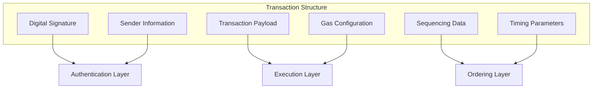
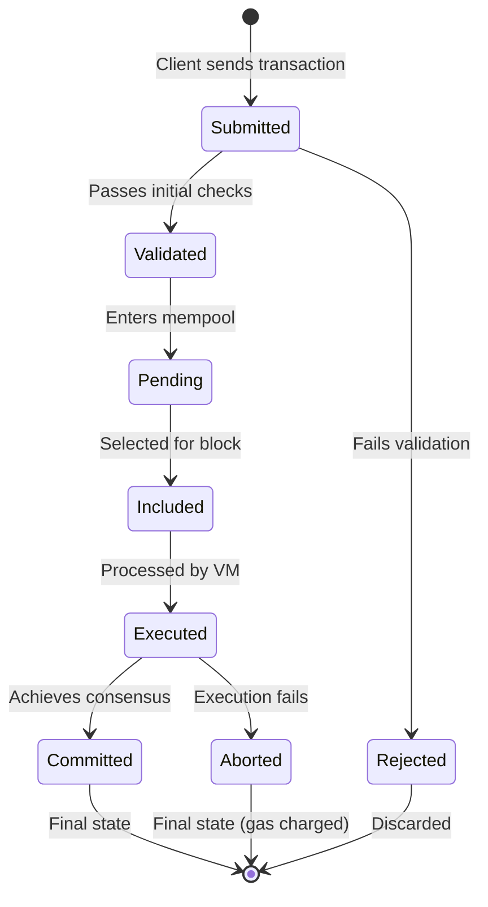
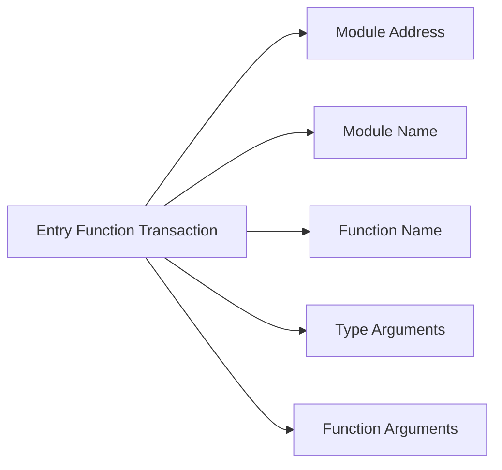
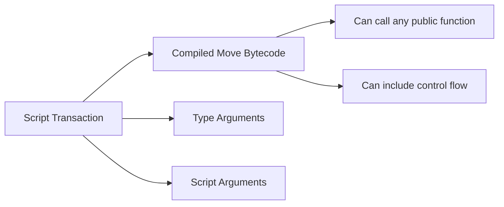
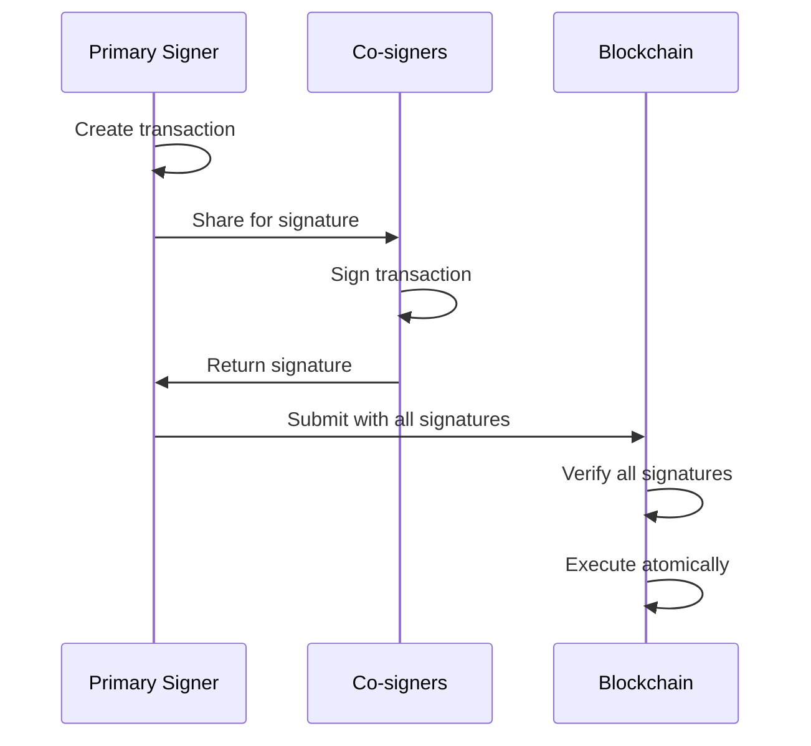
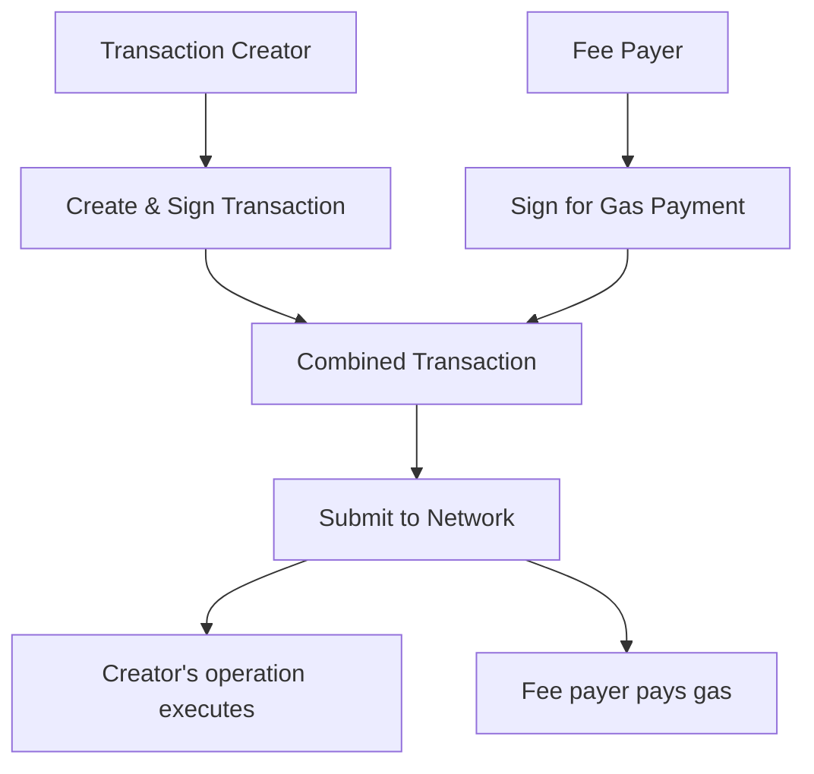

# Understanding Transactions

:::tip Navigation
**📍 You are here:** Understanding Transactions
**➡️ Next:** [States](/concepts/transactions/states)
**🏠 Overview:** [Blockchain Architecture](/concepts/blockchain)
:::

The Cedra blockchain operates through transactions - the fundamental units of change that transform the blockchain state. Every action, from transferring CED tokens to deploying smart contracts, is encapsulated within a transaction structure that ensures security, ordering, and deterministic execution. For a broader understanding of how transactions fit into the overall blockchain architecture, see our [Blockchain Deep Dive](/concepts/blockchain).

:::info Core Principle
Only transactions can modify the blockchain state. Without a valid, executed transaction, the ledger remains immutable.
:::

## Transaction Anatomy

A transaction on Cedra contains several critical components that work together to ensure secure and verifiable state changes:

### Authentication Components
These components verify the identity and authorization of the transaction sender, ensuring only the rightful owner can initiate transactions from an account.

**Digital Signature**: Every transaction must be cryptographically signed using the sender's private key. Cedra primarily uses Ed25519 signatures, providing 128-bit security with efficient verification. The signature proves that the transaction originator controls the sending account.

**Sender Address**: A 32-byte identifier uniquely identifying the account initiating the transaction. This address is derived from the account's authentication key.

**Sender Public Key**: The public component of the key pair used to sign the transaction. This enables validators to verify the signature's authenticity without accessing the private key.

### Execution Components
These components define what the transaction does and how much computational resources it can consume, containing the actual logic and resource limits.

**Payload**: The payload defines what the transaction will do. It contains:
- The target function or script to execute
- Type arguments for generic functions
- Function arguments with actual values
- Module deployment data (for deployment transactions)

**Gas Unit Price**: The amount of Octas (smallest unit of CED, where 1 CED = 100,000,000 Octas) the sender is willing to pay per unit of computational work. Higher prices incentivize faster processing.

**Maximum Gas Amount**: An upper limit on the total gas units the sender will pay for. This protects users from unexpectedly expensive transactions while ensuring validators are compensated.

### Ordering Components
These components ensure transactions are processed in the correct sequence and within valid timeframes, preventing replay attacks and maintaining consistency.

**Sequence Number**: An incrementing counter that must match the sender's current account sequence number. This prevents replay attacks and ensures transaction ordering from the same account.

**Expiration Timestamp**: A Unix timestamp after which the transaction becomes invalid. This prevents old, unprocessed transactions from executing unexpectedly.

**Chain ID**: Identifies which Cedra network (testnet, mainnet) the transaction targets, preventing cross-network replay attacks.

## Transaction States

Transactions progress through distinct states during their lifecycle:

**Committed and Executed**: The ideal outcome. The transaction successfully modifies the blockchain state as intended.

**Committed and Aborted**: The transaction was processed but failed during execution (e.g., insufficient balance for transfer). Gas is still charged, and the transaction is recorded, but state changes are rolled back.

**Discarded**: The transaction never made it to execution due to validation failures, timeout, or network issues. No gas is charged as the transaction never touched the blockchain.

## Transaction Types

### Entry Function Transactions

The most common transaction type, calling publicly exposed functions in deployed Move modules. Entry functions serve as the primary interface between users and smart contracts, providing a safe and straightforward way to interact with on-chain logic. They're ideal for standard operations like token transfers, NFT minting, or DeFi protocol interactions.

Entry functions are specially marked functions that can be called directly from transactions. They provide a safe, controlled interface to smart contract functionality.

### Script Transactions

More flexible than entry functions, scripts can call multiple functions and include custom logic. Scripts allow developers to compose complex operations that span multiple modules or require conditional execution paths. They're particularly useful for batch operations, complex DeFi strategies, or one-time administrative tasks that don't warrant deploying a full module.

Scripts offer greater flexibility but require more careful construction and validation.

### Multi-Agent Transactions

Transactions requiring multiple signatures, useful for shared accounts or atomic multi-party operations. Multi-agent transactions enable complex coordination between multiple parties in a single atomic operation - all signers must approve, and either all actions succeed or everything rolls back. Common use cases include escrow services, multi-party swaps, DAO governance actions, and shared treasury management.

### Sponsored Transactions

Allow one account to pay gas fees for another account's transaction:

## Transaction Size Limits

The Cedra blockchain enforces size constraints to maintain network efficiency:

| Component | Standard Limit 
|-----------|---------------|
| Transaction size | 64 KB |
| Governance transaction size 1 | MB |
| Single write operation | 1 MB |
| Combined write operations | 10 MB |
| Number of write operations | 8,192 |
| Single event | 1 MB |
| Combined events | 10 MB |

---

## Next Steps

Now that you understand transaction structure and types, explore:

- **[States and State Transitions](/concepts/transactions/states)** - Learn how transactions modify the blockchain state
- **[Proofs and Verification](/concepts/transactions/proofs-and-verification)** - Understand the cryptographic guarantees
- **[Blockchain Architecture](/concepts/blockchain)** - See how transactions fit into the broader system