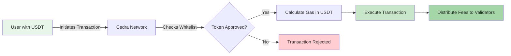

# ⛽ Custom Gas Tokens

## Revolutionary Gas Payment System

Custom Gas Tokens transform how users interact with the Cedra blockchain by enabling transaction fee payments in any whitelisted token. This groundbreaking feature eliminates the barrier of needing native CED tokens, opening the network to mainstream adoption.

## What Are Custom Gas Tokens?

Custom gas tokens are fungible assets deployed on Cedra that have been approved for transaction fee payments. Instead of requiring users to hold CED tokens for gas, they can use familiar stablecoins like USDT or USDC, or even project-specific tokens.

## Why This Matters

### For Users
- **Zero CED Required**: Execute transactions without ever holding native tokens
- **Simplified Experience**: Use the same token for both payments and fees
- **Familiar Assets**: Pay with stablecoins you already know and trust

### For Projects
- **Enhanced Token Utility**: Your token becomes the complete payment solution
- **Frictionless Onboarding**: Remove the biggest barrier for new users
- **Economic Flexibility**: Design custom fee models and incentive structures

### For Validators
- **Diverse Revenue Streams**: Receive fees in multiple valuable tokens
- **Market Choice**: Convert to preferred assets or hold strategic positions
- **Increased Activity**: More users means more transaction volume

## How It Works

The custom gas token system integrates seamlessly into Cedra's transaction flow:



1. **Token Deployment**: Projects create fungible assets using Cedra's stablecoin framework
2. **Permission Configuration**: Token creators authorize the network to use their token for gas
3. **Whitelisting**: Tokens are added to the approved list (via admin on testnet, governance on mainnet)
4. **User Selection**: When sending transactions, users specify which whitelisted token to use for gas
5. **Automatic Processing**: The network calculates the required amount and processes the payment

## Real-World Use Cases

### 🏦 DeFi Protocols
Enable users to pay gas with yield-bearing stablecoins, creating additional revenue while simplifying the user experience. Users can stake, swap, and provide liquidity without ever touching CED.

### 🎮 Gaming Projects
Players use only in-game tokens for all transactions. No need to explain blockchain complexity or manage multiple wallets - just play and pay with game tokens.

### 🏢 Enterprise Applications
Corporate users transact entirely in approved stablecoins, simplifying accounting, compliance, and treasury management while maintaining blockchain benefits.

### 🌐 Cross-Chain Projects
Bridge tokens from other chains and use them directly for gas, eliminating the multi-step process of acquiring native tokens.

## Technical Implementation

Custom gas tokens leverage several Cedra framework modules:

- **Stablecoin Module**: Provides fungible asset creation and management
- **Whitelist Module**: Maintains the list of approved gas tokens
- **Gas Calculator**: Converts gas units to token amounts based on configured rates
- **Fee Distributor**: Routes gas payments to validators in their preferred tokens

## Getting Started

Ready to enable gas payments with your token? Follow our comprehensive guide:

<div className="grid grid-cols-1 md:grid-cols-2 gap-4 mt-4">
  <div className="border rounded-lg p-4">
    <h3>📝 Create Your Gas Token</h3>
    <p>Step-by-step guide to deploy and configure your token for gas payments</p>
    <a href="/gas-tokens/custom-gas-tokens">Start Building →</a>
  </div>

  <div className="border rounded-lg p-4">
    <h3>🗳️ Governance Process</h3>
    <p>Learn about the approval process for mainnet deployment</p>
    <a href="/gas-tokens/governance">Coming Soon →</a>
  </div>
</div>

## Example: Pay Gas with USDT

Traditional transaction (requires CED):
```bash
cedra account transfer --account 0x123... --amount 100
```

Same transaction using USDT for gas:
```bash
cedra account transfer \
    --account 0x123... \
    --amount 100 \
    --fa-address 0x35c82a4f...::usdt::USDT \
    --max-gas 5000
```

## Network Support

| Network | Admin Whitelist | Governance | Available Now |
|---------|----------------|------------|---------------|
| Testnet | ✅ Yes | Coming Soon | ✅ Yes |
| Devnet | ✅ Yes | Coming Soon | ✅ Yes |
| Mainnet | ❌ No | Required | 🚧 Coming Soon |

## Benefits Summary

Custom gas tokens represent a fundamental advancement in blockchain usability:

- **Mainstream Adoption**: Remove technical barriers for everyday users
- **Economic Innovation**: Enable new business models and fee structures
- **Network Growth**: Attract users who would never acquire native tokens
- **Ecosystem Diversity**: Support multiple token economies simultaneously

Start building your gas token today and be part of the revolution in blockchain accessibility!

<style>{`
.grid {
  display: grid;
}
.grid-cols-1 {
  grid-template-columns: repeat(1, minmax(0, 1fr));
}
@media (min-width: 768px) {
  .md\\:grid-cols-2 {
    grid-template-columns: repeat(2, minmax(0, 1fr));
  }
}
.gap-4 {
  gap: 1rem;
}
.mt-4 {
  margin-top: 1rem;
}
.border {
  border: 1px solid var(--ifm-color-emphasis-300);
}
.rounded-lg {
  border-radius: 0.5rem;
}
.p-4 {
  padding: 1rem;
}
`}</style>