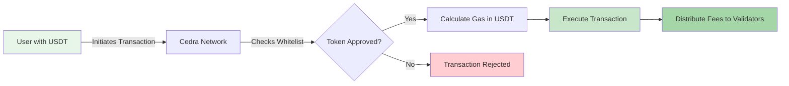

# ⛽ Custom Gas Tokens

Custom Gas Tokens transform how users interact with the Cedra blockchain by enabling transaction fee payments in any whitelisted token. This groundbreaking feature eliminates the barrier of needing native CED tokens, opening the network to mainstream adoption.

Custom gas tokens are fungible assets deployed on Cedra that have been approved for transaction fee payments. Instead of requiring users to hold CED tokens for gas, they can use familiar stablecoins like USDT or USDC, or even project-specific tokens.

  

    <h3>📝 Create Your Gas Token</h3>
    
Step-by-step guide to deploy and configure your token for gas payments

    <a href="/gas-tokens/custom-gas-tokens">Start Building →</a>
  

  

    <h3>🗳️ Governance Process</h3>
    
Learn about the approval process for mainnet deployment

    <a href="/gas-tokens/governance">Coming Soon →</a>
  

### For Users
- **Zero CED Required**: Execute transactions without ever holding native tokens
- **Simplified Experience**: Use the same token for both payments and fees
- **Familiar Assets**: Pay with stablecoins you already know and trust

### For Projects
- **Enhanced Token Utility**: Your token becomes the complete payment solution
- **Frictionless Onboarding**: Remove the biggest barrier for new users
- **Economic Flexibility**: Design custom fee models and incentive structures

The custom gas token system integrates seamlessly into Cedra's transaction flow:

1. **Token Deployment**: Projects create fungible assets using Cedra's stablecoin framework
2. **Permission Configuration**: Token creators authorize the network to use their token for gas
3. **Whitelisting**: Tokens are added to the approved list (via admin on testnet, governance on mainnet)
4. **User Selection**: When sending transactions, users specify which whitelisted token to use for gas
5. **Automatic Processing**: The network calculates the required amount and processes the payment
Ready to enable gas payments with your token? Follow our comprehensive guide:

