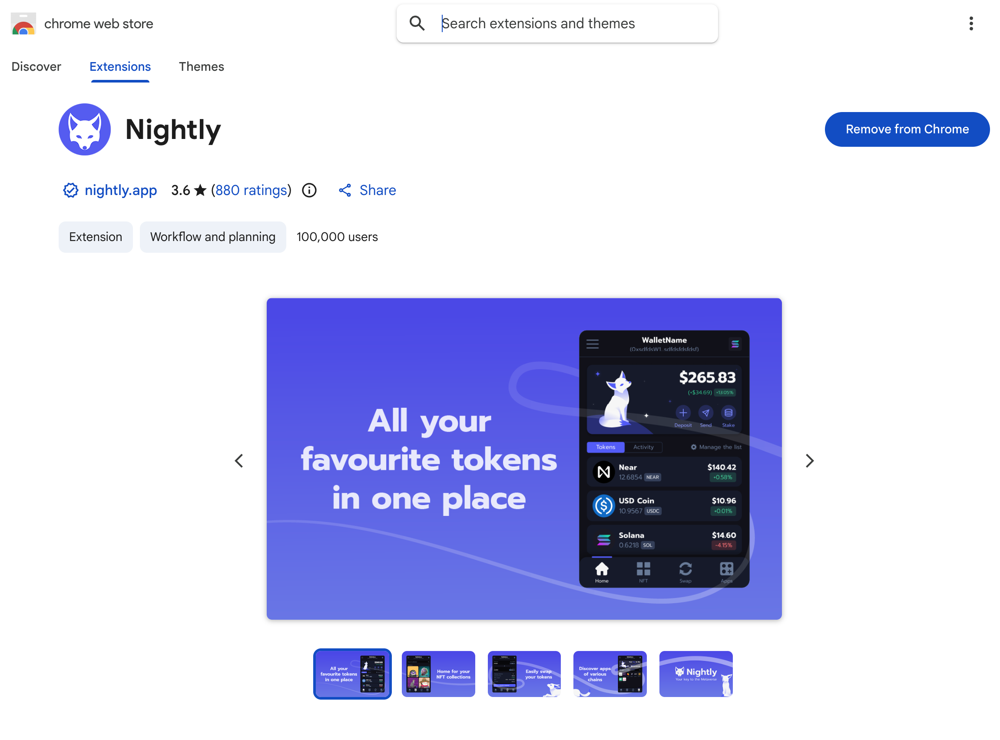
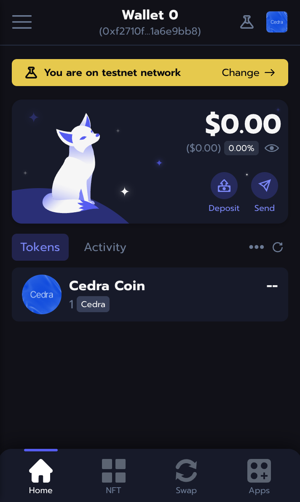
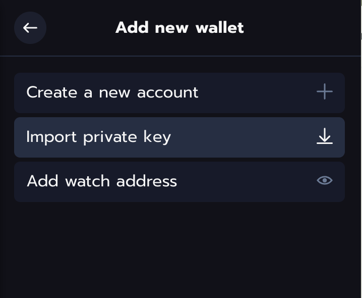

# Nightly Wallet

Nightly is a browser extension and mobile wallet that works with multiple chains including Cedra.

**Website:** [nightly.app](https://nightly.app)

1. Go to [nightly.app](https://nightly.app) and click **Download**
2. Pick your browser (Chrome, Firefox, Safari, or Edge)
3. Click **Add to Browser**




## Create a wallet

1. Click the Nightly icon in your browser toolbar
2. Click **Create a new wallet**
3. Pick how you want to secure it:
   - **Seed phrase** - you control everything
   - **Social login** - easier setup, recovery depends on the service
4. Write down your 12 words somewhere safe
5. Confirm your recovery phrase

:::warning Keep your seed phrase safe
Anyone with your seed phrase can take your funds. Write it down on paper and store it offline.
:::

## Add Cedra network

1. Click the network selector at the top of the wallet
2. Search for **Cedra**
3. Pick **Cedra Testnet**



## Import an existing account

Already have a Cedra account from the CLI? Import it:

1. Click **Import Wallet**
2. Choose **Private Key** or **Seed Phrase**
3. Paste your credentials

Export your private key from CLI:
```bash
cedra config show-private-key --profile default
```
Import it via Add New Wallet


## Check it works

1. Switch to Cedra network
2. You should see your address (starts with `0x`)
3. On testnet, grab some tokens from the [faucet](/getting-started/faucet)

## Next steps

- Get testnet tokens from the [Faucet](/getting-started/faucet)
- See [wallet integration](/sdks/typescript-sdk) for connecting wallets to your dApp
