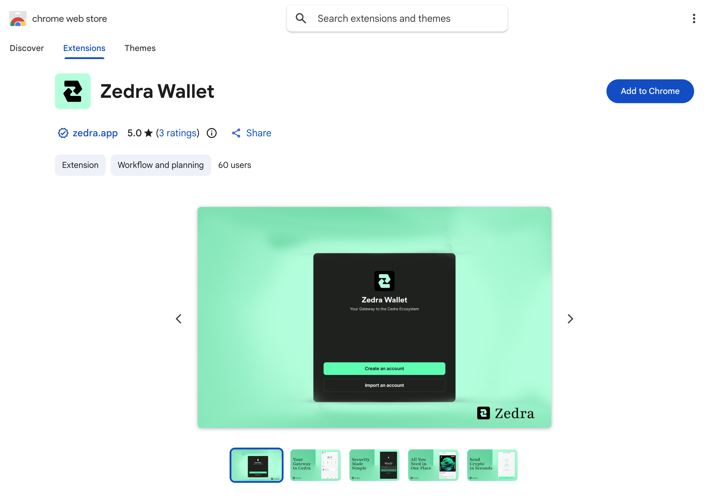

# Zedra Wallet

Zedra is a browser wallet made for Cedra.

1. Go to [zedra.app](https://zedra.app)
2. Click **Download** or **Install Extension**
3. Pick your browser and confirm



### Create a wallet

1. Click the Zedra icon in your browser toolbar
2. Click **Create Wallet**
3. Set a password
4. Write down your 12 words somewhere safe
5. Confirm your recovery phrase

:::warning Keep your seed phrase safe
Anyone with your seed phrase can take your funds. Write it down on paper and store it offline.
:::

### Pick a network

1. Open Zedra
2. Click the network selector
3. Choose **Cedra Testnet**

## Import an existing account

Already have a Cedra account from the CLI? Import it:

1. Click **Import Wallet**
2. Enter your seed phrase or private key

Export your private key from CLI:
```bash
cedra config show-private-key --profile default
```

## Check it works

1. You should see your address (starts with `0x`)
2. On testnet, grab some tokens from the [faucet](/getting-started/faucet)

## Next steps

- Get testnet tokens from the [Faucet](/getting-started/faucet)
- See [wallet integration](/sdks/typescript-sdk) for connecting wallets to your dApp
