//TODO: WIP
---
title: How Indexing Works
sidebar_position: 2
---

# How Cedra Indexing Works

Understand the complete journey from blockchain transactions to queryable data in your applications.

## 🔄 The Indexing Pipeline

```mermaid
graph LR
    subgraph "Cedra Network"
        BN[🔗 Blockchain<br/>Nodes]
        TS[📡 Transaction<br/>Stream]
    end
    
    subgraph "Your Indexer"
        P[⚙️ Processor]
        DB[(🗄️ PostgreSQL)]
    end
    
    subgraph "Query Layer"
        GQL[📊 GraphQL API]
        APP[💻 Your App]
    end
    
    BN -->|Transactions| TS
    TS -->|Stream| P
    P -->|Store| DB
    DB -->|Serve| GQL
    GQL -->|Query| APP
    
    style BN fill:#e3f2fd
    style TS fill:#e3f2fd
    style P fill:#fff3e0
    style DB fill:#e8f5e9
    style GQL fill:#f3e5f5
    style APP fill:#fce4ec
```



## 📦 What's in a Transaction?

Every transaction your indexer receives contains:

<details>
<summary>**Events** - What happened during execution</summary>

```rust
// Example: Token Transfer Event
Event {
    account_address: "0x123...",
    type: "0x1::coin::TransferEvent",
    data: {
        from: "0xabc...",
        to: "0xdef...",
        amount: 1000000
    }
}
```

Events are perfect for:
- ✅ Activity feeds
- ✅ Transaction history
- ✅ User analytics

</details>

<details>
<summary>**State Changes** - How storage was modified</summary>

```rust
// Example: Balance Update
WriteSet {
    resource: "0x1::coin::CoinStore",
    address: "0x456...",
    data: {
        coin: { value: 5000000 },
        frozen: false
    }
}
```

State changes are essential for:
- ✅ Current balances
- ✅ Ownership tracking
- ✅ Protocol state

</details>

<details>
<summary>**Metadata** - Transaction details</summary>

```rust
// Transaction context
Transaction {
    version: 1234567,        // Unique sequence number
    hash: "0xabc123...",     // Transaction identifier
    timestamp: 1704067200,   // When it happened
    success: true,           // Execution status
    gas_used: 1500          // Computational cost
}
```

</details>

## 🎯 Processing Flow

### Step 1: **Connect to Stream**
Your processor connects to Cedra's Transaction Stream Service:

```yaml
# No authentication needed - it's public!
transaction_stream:
  endpoint: https://testnet.cedra.dev
  batch_size: 1000  # Process 1000 txns at once
```

### Step 2: **Extract Data**
Choose what to index based on your needs:

| **Strategy** | **Use When** | **Example** |
|-------------|--------------|-------------|
| **Events Only** | Tracking actions | DEX swaps, transfers |
| **State Only** | Current values | Token balances, TVL |
| **Hybrid** | Complete picture | Full protocol state |

### Step 3: **Transform & Store**
Process data and save to PostgreSQL:

```rust
// Simplified processing logic
async fn process(transactions: Vec<Transaction>) {
    for txn in transactions {
        // Extract relevant events
        let events = txn.events
            .filter(|e| e.type.contains("YourContract"));
        
        // Transform to your schema
        let records = events.map(|e| transform(e));
        
        // Batch insert to database
        database.insert_batch(records).await;
    }
}
```

### Step 4: **Query via GraphQL**
Your data is instantly available:

```graphql
query YourCustomData {
  your_table(
    where: {timestamp: {_gte: "2024-01-01"}}
    order_by: {value: desc}
  ) {
    id
    timestamp
    value
    metadata
  }
}
```

## ⚡ Key Features

### 🔄 **Real-time Processing**
- Transactions indexed within seconds
- Live data feeds for dashboards
- WebSocket subscriptions available

### 🛡️ **Reliability Built-in**
- **Version Tracking**: Sequential processing guaranteed
- **Automatic Recovery**: Resume from last checkpoint
- **No Data Loss**: Every transaction processed exactly once

### 📈 **Scalable Architecture**
- Process millions of transactions
- Parallel processing support
- Optimized batch operations

## 🎬 See It In Action

<details>
<summary>**Example: Indexing Token Transfers**</summary>

1. **Transaction occurs** on Cedra blockchain
2. **Stream delivers** to your processor (< 1 second)
3. **Processor extracts** transfer events
4. **Data stored** in PostgreSQL
5. **GraphQL serves** to your application

Total time: ~2-3 seconds from transaction to queryable data!

</details>

## 📊 Version System

Cedra uses a sequential version system that ensures data consistency:

```
Transaction Version Timeline:
[1] → [2] → [3] → [4] → [5] → ...
 ↑
Your indexer processes each version exactly once
```

Benefits:
- ✅ **No gaps**: Every transaction captured
- ✅ **Ordered**: Process in exact sequence
- ✅ **Resumable**: Restart from any version
- ✅ **Verifiable**: Check processing completeness

## 🚦 Processing Status

Monitor your indexer's progress:

```sql
-- Check current processing status
SELECT * FROM processor_status;

┌─────────────┬────────────────────┬─────────────────┐
│ processor   │ last_success_version │ last_updated    │
├─────────────┼────────────────────┼─────────────────┤
│ my_indexer  │ 1234567           │ 2024-01-15 10:30 │
└─────────────┴────────────────────┴─────────────────┘
```

## 🔍 What Happens During a Restart?

The indexer automatically handles failures:


No manual intervention needed - just restart and continue!

## 💡 Best Practices

:::tip Performance Tips
- **Batch Operations**: Process 1000-5000 transactions per batch
- **Index Strategy**: Create database indexes on frequently queried fields
- **Monitor Lag**: Keep processing within 100 versions of chain tip
:::

:::warning Common Pitfalls
- Don't process transactions one-by-one (too slow)
- Don't skip version tracking (loses recovery ability)
- Don't ignore failed transactions (may contain important reverts)
:::

## 🎯 Next Steps

Now that you understand how indexing works:

1. **[Build Your First Indexer](/indexer/quickstart)** - Hands-on tutorial
2. **[Explore Architecture](/indexer/architecture)** - Deep dive into components
3. **[Common Queries](/indexer/common-queries)** - GraphQL patterns

---

:::success Ready to Build?
You now understand the complete indexing flow. Time to create your first processor! 

**[Continue to Quick Start →](/indexer/quickstart)**
:::