# What are Processors

Processors are the core engines that power Cedra's indexing infrastructure. They extract, transform, and store blockchain data into structured formats that can be efficiently queried through GraphQL.

:::info Key Concept
Think of processors as specialized data pipelines - each one designed to handle specific types of blockchain data (events, coins, NFTs, etc.) and transform it into queryable database records.
:::

### What Makes a Processor?

A processor is a specialized program that:
1. **Connects** to Cedra's transaction stream
2. **Extracts** specific data from transactions
3. **Transforms** raw data into structured formats
4. **Stores** processed data in PostgreSQL

```mermaid
graph LR
    subgraph "Cedra Network"
        CN[🔗 Cedra Nodes]
        TS[📡 Stream]
    end
    
    subgraph "Processor"
        E[🔍 Extract]
        T[⚙️ Transform]
        L[💾 Load/Store]
    end
    
    subgraph "Storage"
        PG[(PostgreSQL)]
        GQL[GraphQL API]
    end
    
    CN -->|Transactions| TS
    TS -->|Stream| E
    E --> T
    T --> L
    L --> PG
    PG --> GQL
    
    style CN fill:#e3f2fd
    style TS fill:#e3f2fd
    style E fill:#fff3e0
    style T fill:#fff3e0
    style L fill:#fff3e0
    style PG fill:#e8f5e9
    style GQL fill:#f3e5f5
```



---

## 📦 Events Processor Deep Dive

Let's explore the **Events Processor** - the most commonly used processor that indexes all blockchain events.

#### What It Does

The Events Processor captures EVERY event emitted on the Cedra blockchain:
- Smart contract events (swaps, mints, burns)
- System events (staking, governance)
- Custom protocol events


Using the [cedra-indexer-processors-v2](https://github.com/cedra-labs/cedra-indexer-processors-v2) repository:

#### Configuration

Create a `config.yaml`:

```yaml
health_check_port: 8084

processor_config:
  type: "events_processor"
  channel_size: 1000

processor_mode:
  type: default
  initial_starting_version: 0

transaction_stream_config:
  indexer_grpc_data_service_address: "GRPC_ADDRESS"
  request_name_header: "events-processor"

db_config:
  postgres_connection_string: "postgresql://localhost:5432/cedra_events"
```

#### Run the Processor

```bash
# Clone the repository
git clone https://github.com/cedra-labs/cedra-indexer-processors-v2
cd cedra-indexer-processors-v2/processor

# Build and run
cargo run --release -- -c config.yaml
```

#### Data Flow Example

Here's how an event flows through the system:


#### Querying Indexed Events

Once the processor is running, query your events via GraphQL. Here's an example for tracking token activities:

```graphql
# Query at https://graphql.cedra.dev/v1/graphql
query GetTokenActivity($token_id: String!, $limit: Int!) {
  token_activities_v2(
    where: { token_data_id: { _eq: $token_id }}
    order_by: { transaction_timestamp: desc }
    limit: $limit
  ) {
    transaction_version
    from_address
    to_address
    token_amount
    type
    transaction_timestamp
  }
}
```

📖 **See more examples:** Check out our [Common Queries](/indexer/common-queries) guide for ready-to-use GraphQL queries for wallets, NFTs, analytics, and more.

## 🔄 Processing Modes

Processors can run in three different modes, each serving a specific purpose:

### **Default Mode** (Bootstrap)
The standard mode for continuous indexing:

```yaml
processor_mode:
  type: default
  initial_starting_version: 0  # Start from genesis
```

**How it works:**
- First run: Starts from `initial_starting_version`
- Restarts: Resumes from last checkpoint in `processor_status` table
- Use case: Production indexing

<details>
<summary>**View Default Mode Flow**</summary>


</details>

### **Backfill Mode**
For reprocessing historical data or fixing issues:

```yaml
processor_mode:
  type: backfill
  backfill_id: "fix_missing_events_v1"  # Unique identifier
  initial_starting_version: 1000000
  ending_version: 2000000
  overwrite_checkpoint: false  # Set true to restart
```

**How it works:**
- Processes specific version range
- Tracks progress separately in `backfill_processor_status`
- Won't interfere with main processor
- Use case: Data corrections, adding new indexes

<details>
<summary>**When to Use Backfill**</summary>

Use backfill mode when you need to:
- 🔧 Fix data inconsistencies
- 📊 Add new derived metrics
- 🔍 Reindex with updated logic
- 📈 Process missed transactions

Example scenario: You updated your processor to extract additional fields from events. Use backfill to reprocess historical data with the new logic.

</details>

### **Testing Mode**
For development and debugging:

```yaml
processor_mode:
  type: testing
  override_starting_version: 5000000
  ending_version: 5000100  # Optional, defaults to single transaction
```

**How it works:**
- Processes specific transactions
- Does NOT update checkpoints
- Perfect for debugging
- Use case: Testing new extraction logic

## Next Steps

Now that you understand processors:

### 🚀 **Quick Start**
1. Clone [cedra-indexer-processors-v2](https://github.com/cedra-labs/cedra-indexer-processors-v2)
2. Start with the events processor for comprehensive data
3. Configure your database connection
4. Query via [GraphQL Playground](https://cloud.hasura.io/public/graphiql?endpoint=https://graphql.cedra.dev/v1/graphql)

### 📚 **Learn More**
- **[How Indexing Works](/indexer/how-it-works)** - Understand the complete data pipeline
- **[SDK Guide](/indexer/sdk)** - Quick start with processors
- **[Common Queries](/indexer/common-queries)** - Ready-to-use GraphQL patterns

### 🛠️ **Build Real Applications**
- **[Build a DEX](/guides/dex)** - Use processors for swap tracking
- **[NFT Platform](/guides/first-nft)** - Index NFT collections and trades
- **[Fungible Assets](/guides/first-fa)** - Track token balances and transfers

