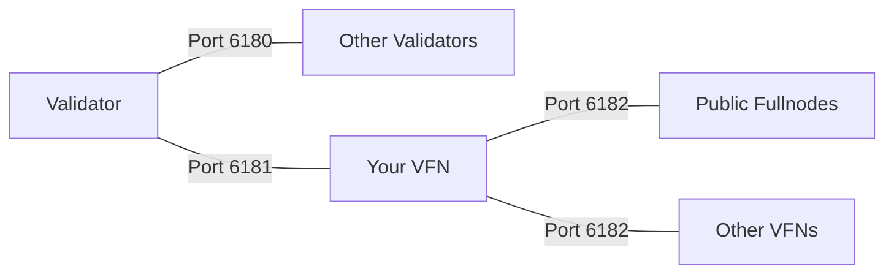

# Node Requirements

To ensure your Cedra validator and validator fullnode (VFN) operate smoothly, both nodes must meet the specifications outlined in this guide. We strongly recommend running validators and VFNs on separate, well-provisioned machines to maintain security and performance isolation.

:::warning Critical
Failure to meet these requirements will result in consensus failures, reward losses, and general node instability under load.
:::

#### Hardware Specifications

Your hardware must be capable of maintaining ~30,000 transactions per second (TPS). You can verify this through our reference specifications or by running the Cedra performance benchmarking tool.

| Component | Specification |
|-----------|--------------|
| **CPU** | 32 cores, 2.8GHz or faster, AMD Milan EPYC or Intel Xeon Platinum |
| **Memory** | 64GB RAM |
| **Storage** | 3.0 TB SSD with at least 60K IOPS and 200MiB/s bandwidth |
| **Network** | 1Gbps bandwidth |

#### Cloud Provider Recommendations

import Tabs from '@theme/Tabs';
import TabItem from '@theme/TabItem';

<Tabs>
  <TabItem value="aws" label="AWS" default>

  - **c6id.16xlarge** - With local SSD
  - **c6i.16xlarge** + io2 EBS volume with 60K IOPS

  </TabItem>
  <TabItem value="gcp" label="GCP">

  - **t2d-standard-60** + pd-ssd with 60K IOPS

  </TabItem>
  <TabItem value="azure" label="Azure">

  - **Standard_D64_v5** with 64K IOPS

  </TabItem>
  <TabItem value="latitude" label="Latitude.sh">

  - **m4.large**, **rs4.large** or **rs4.xlarge** with 64K IOPS

  </TabItem>
</Tabs>

:::tip Performance Testing
Run the Cedra performance benchmark to verify your hardware:

```bash
# Clone cedra-core and install dependencies first
TABULATE_INSTALL=lib-only pip install tabulate
./testsuite/performance_benchmark.sh --short
```

The tool will display TPS in the "t/s" column and warn if requirements aren't met.
:::

**Local SSD vs Network Storage Trade-offs:**
- **Local SSD**: Lower latency, better IOPS/cost ratio, but limited backup options
- **Network Storage** (AWS EBS, GCP PD): Better reliability, easier backups, higher availability, but requires CPU overhead for IOPS scaling

:::info Database Growth
Current estimates for testnet and mainnet: Several hundred GB of storage required. Archival nodes require unbounded storage as they maintain complete blockchain history.
:::

## Network Configuration

There are three Cedra network layers:

- **Validator network**: Used exclusively by Cedra validators to connect to each other for consensus. Validator fullnodes (VFNs) and public fullnodes (PFNs) do not use this network.
- **VFN network**: A private link between a validator and its Validator Fullnode (VFN). This network is used for fast, trusted data replication from the validator to its paired VFN.
- **Public network**: The public peer-to-peer network where VFNs and Public Fullnodes (PFNs) connect to other VFNs and PFNs. This allows public node operators to access and serve the blockchain.

### Port Requirements by Node Type

<Tabs>
  <TabItem value="validator" label="Validator Node" default>

  **Open Ports (TCP):**
  - `6180` - **Validator Network** (Public): Connect to other validators
  - `6181` - **VFN Network** (Private): Only accessible by your VFN

  **Closed Ports:**
  - `6182` - Public network
  - `9101` - Inspection service
  - `9102` - Admin service  
  - `80/8080` - REST API

  </TabItem>
  <TabItem value="vfn" label="VFN Node">

  **Open Ports (TCP):**
  - `6181` - **VFN Network** (Private): Only accessible by your validator
  - `6182` - **Public Network** (Public): Allow PFN connections

  **Closed Ports:**
  - `9101` - Inspection service
  - `9102` - Admin service
  - `80/8080` - REST API

  </TabItem>
</Tabs>

:::caution Security Warning
Never publicly expose inspection (9101) or admin (9102) service ports. These are strictly for internal debugging and can be exploited if exposed. If you must expose the REST API, implement authentication and rate limiting.
:::



:::note Required
Enable NTP (Network Time Protocol) synchronization to maintain accurate system time. Nodes with incorrect time will lag behind the network and validators may fail to propose blocks.
:::
