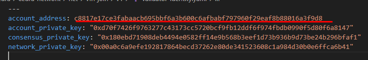

# Validator Setup and Configuration

:::important Validator Application Required
To become a validator on the Cedra network, you must submit an application for review. Please fill out the [Validator Application Form](https://tally.so/r/mDRz5b) and our team will review your submission. This helps ensure network security and validator quality.
:::

This guide walks you through the complete journey of setting up a Cedra validator node for testnet participation. By following these steps, you'll transform your machine into a validator that helps secure the network and earn staking rewards.

:::caution Testnet Only
This guide is for **testnet participation only**. Mainnet validator requirements and procedures will differ significantly. Always use testnet tokens and never real funds.
:::

## Install Cedra Node

Your validator journey begins with obtaining the Cedra Network source code. You'll clone the official repository and switch to the testnet branch where all the latest testnet features are available.

```bash
# Clone the official Cedra Network repository to your local machine
git clone https://github.com/cedra-labs/cedra-network.git

# Navigate into the newly cloned repository
cd cedra-network

# Switch to the testnet branch to access testnet-specific configurations
git checkout testnet
```

**What's happening:** You now have the complete Cedra Network codebase on your machine, positioned on the testnet branch. This gives you access to all the tools needed to run a validator node.

## Create Your Validator's Home

Every validator needs a dedicated workspace to store its configuration files, keys, and state data. Let's create an organized directory structure that will house all your validator's essential files.

```bash
# Create the main network directory in the repository root
# This will be your validator's primary workspace
mkdir net
```

Now, let's organize your validator workspace with specific subdirectories:

```bash
# Navigate into the net directory and create two essential subdirectories:
# - v1: Will store your validator's keys and configuration
# - genesis: Will contain the network's genesis state and waypoint
cd net
mkdir v1 genesis
```

**What's happening:** You've created a clean, organized structure for your validator. The `v1` directory will hold your unique validator identity, while `genesis` will contain the network's initial state that all validators must agree upon.

## Download Network Genesis Files

Every validator must start from the same network state to maintain consensus. You'll need to download two critical files that define the testnet's initial configuration.

```bash
# Navigate to the genesis directory
cd genesis
```

Now download these essential files:
- [genesis.blob](https://github.com/cedra-labs/cedra-networks/blob/main/testnet/genesis.blob) - Contains the initial network state
- [waypoint.txt](https://github.com/cedra-labs/cedra-networks/blob/main/testnet/waypoint.txt) - Provides a trusted checkpoint for network synchronization

Place both files in the `net/genesis` directory.

**What's happening:** These files ensure your validator starts with the correct network state and can verify it's connecting to the legitimate Cedra testnet, preventing any potential network attacks.

## Generate Your Validator Keys

Finally, it's time to create your validator's unique identity. These cryptographic keys will identify your validator on the network and secure its operations.

```bash
# Navigate to the v1 directory where your validator configuration will live
cd ../v1

# Generate your validator's unique cryptographic keys
# This command uses Cargo to build and run the Cedra key generation tool
cargo run --release -p cedra -- genesis generate-keys
```

**What's happening:** This command generates several important cryptographic keys:
- **Validator Identity Key**: Uniquely identifies your validator on the network
- **Consensus Key**: Used to participate in the consensus protocol
- **Network Key**: Secures peer-to-peer communications with other validators

These keys are the foundation of your validator's security and must be kept safe.

## Configure Your Validator for the Network

With your keys generated, it's time to register your validator's configuration with the network. This step defines how other nodes will connect to your validator and establishes your initial stake commitment.

```bash
# Navigate to the genesis directory where network configurations are stored
cd ../genesis

# Register your validator configuration with the network
# This command links your validator identity to network endpoints and stake amount
cargo run --release -p cedra -- genesis set-validator-configuration \
  --username v1 \
  --owner-public-identity-file ../v1/public-keys.yaml \
  --validator-host <your-host>:<port> \
  --full-node-host <your-host>:<port> \
  --local-repository-dir . \
  --stake-amount <amount-in-octas>
```

**Example configuration for local testing:**
```bash
# Configure a validator with minimum stake (100,000 CEDRA = 10^13 octas)
# Note: 1 CEDRA = 10^8 octas (smallest unit)
cargo run --release -p cedra -- genesis set-validator-configuration \
  --username v1 \
  --owner-public-identity-file ../v1/public-keys.yaml \
  --validator-host localhost:6182 \
  --full-node-host localhost:6192 \
  --local-repository-dir . \
  --stake-amount 10000000000000
```

**What's happening:** This command registers your validator with the network genesis, specifying:
- Your validator's network endpoints for consensus and full node operations
- Your initial stake amount (minimum 100,000 CEDRA for testnet)
- Your public identity that other validators will recognize

## Retrieve Your Validator Account Credentials

Your validator has been configured, but you need to save its account credentials for future operations. These credentials will allow you to manage your validator and participate in staking.

```bash
# Navigate back to your validator directory
cd ../v1

# Open the validator identity file to retrieve your account details
cat validator-identity.yaml
```

Look for and securely save these critical values:
- **account_address**: Your validator's unique blockchain address
- **account_private_key**: The private key controlling your validator account



Example address: `c8817e17ce3fabaacb695bbf6a3b600c6afbabf797960f29eaf8b88016a3f9d8`


:::caution Security Notice
Your account_private_key is the master key to your validator. Store it securely and never share it. Anyone with this key can control your validator and its staked funds.
:::

## Initialize Your Validator Owner Account

Finally, you'll set up your local CLI to interact with your validator account. This creates a profile that allows you to manage your validator, stake tokens, and perform administrative tasks.

```bash
# Initialize the Cedra CLI with your validator owner profile
# You'll be prompted to select testnet and enter the private key from Step 6
cedra init --profile owner
```

**What's happening:** This command configures your local Cedra CLI with your validator credentials, creating a named profile called "owner". This profile will be your primary interface for:
- Managing your validator's stake
- Monitoring validator performance
- Executing administrative commands
- Participating in network governance

You can fund the validator owner account directly from the Cedra faucet:

```bash
curl --location --request POST \
  "https://faucet-api.cedra.dev/mint?amount=<AMOUNT>&auth_key=<AUTH_KEY>" \
  --data ''
```

Replace:

- `<AMOUNT>`: amount in octas (1 CEDRA = 10^8 octas). For example, 1 CEDRA = 100000000.
- `<AUTH_KEY>`: your account authentication key from the Cedra CLI profile initialized earlier (stored under your home directory in `.cedra`). If you used the profile name `owner`, look for it inside `~/.cedra/`.

Examples to locate your auth key (macOS/Linux):

```bash
# If you used profile "owner", inspect files under ~/.cedra
grep -R "auth_key" ~/.cedra 2>/dev/null | head -n 5
```

:::info Funding Required
Before proceeding to stake pool management, ensure your validator account is funded with at least 1 CEDRA plus your intended stake amount. This covers transaction fees and meets minimum staking requirements.
:::

## Your Validator Journey Continues

Congratulations! You've successfully set up your validator node's foundation. Your validator now has:
- ✅ The Cedra Network codebase ready to run
- ✅ A structured workspace for all validator files
- ✅ Network genesis files for consensus participation
- ✅ Unique cryptographic keys for secure operation
- ✅ Network configuration with your stake commitment
- ✅ CLI access to manage your validator

## Next Steps

Your validator is configured but not yet active on the network. To complete your journey and start earning rewards, proceed to:

- **[Stake Pool Management](./stake-pool-management)** - Initialize your stake pool, delegate tokens, and officially join the validator set to begin securing the network