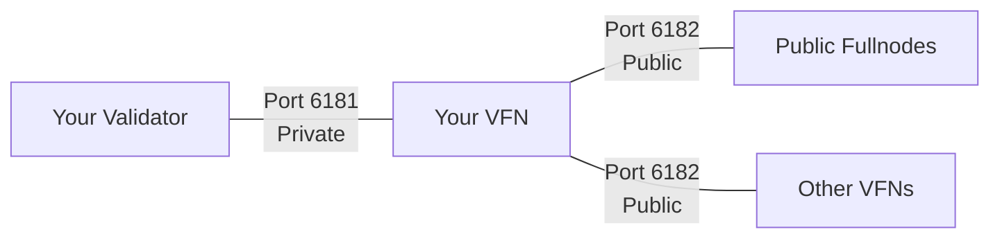

# Validator Full Node (VFN) Requirements

To ensure your validator fullnode (VFN) operates smoothly, it must meet the specifications outlined in this guide. A VFN is a fullnode owned and operated by the same entity as a validator node. It serves as a bridge between your validator and the public network, distributing blockchain data while keeping your validator isolated and secure.

:::warning Critical
Failure to meet these requirements will result in your VFN experiencing degradation under load, consensus failures on your validator, reward losses, and general instability.
:::

:::caution Resource Isolation
Your validator and VFN must run on **two separate and independent machines**. Maintaining resource isolation is critical for security and ensures that neither node encounters performance degradation or instability under load.
:::

## Hardware Specifications

Your VFN hardware must be capable of maintaining ~30,000 transactions per second (TPS). You can verify this through the reference specifications below or by running the Cedra performance benchmarking tool.

| Component | Specification |
|-----------|--------------|
| **CPU** | 48 threads, 5th Gen AMD EPYC (Turin) or 6th Gen Intel Xeon (Granite Rapids) |
| **Memory** | 128GB RAM |
| **Storage** | 3.0 TB Enterprise NVMe SSD with at least 60K IOPS and 600MiB/s bandwidth |
| **Network** | 1Gbps bandwidth |

### Cloud Provider Recommendations

import Tabs from '@theme/Tabs';
import TabItem from '@theme/TabItem';

<Tabs>
  <TabItem value="aws" label="AWS" default>

  - **c8a.16xlarge** + io2 EBS volume or multiple gp3 EBS volumes with 60K IOPS

  </TabItem>
  <TabItem value="gcp" label="GCP">

  - **c4d-standard-48** + hyperdisk-balanced with 60K IOPS

  </TabItem>
  <TabItem value="azure" label="Azure">

  - **Standard_F48as_v7** with 60K IOPS

  </TabItem>
  <TabItem value="latitude" label="Latitude.sh">

  - **f4.metal.large** with 60K IOPS

  </TabItem>
</Tabs>

:::tip Performance Testing
Run the Cedra performance benchmark to verify your hardware:

```bash
# Clone cedra-core and install dependencies first
TABULATE_INSTALL=lib-only pip install tabulate
./testsuite/performance_benchmark.sh --short
```

The tool will display TPS in the "t/s" column and warn if requirements aren't met.
:::

### Storage Considerations

**Local SSD vs Network Storage Trade-offs:**
- **Local SSD**: Lower latency, better IOPS/cost ratio, but limited backup options
- **Network Storage** (AWS EBS, GCP PD): Better reliability, easier backups, higher availability, but requires CPU overhead for IOPS scaling

:::info Database Growth
The size of the database on your VFN depends on the ledger history and the number of on-chain states. Both factors are influenced by the age of the blockchain, the average transaction rate, and the ledger pruner configuration. Current estimates for testnet and mainnet require several hundred GB of storage.
:::

## Network Configuration

Your VFN participates in two of the three Cedra network layers:

- **VFN network**: A private link between your validator and your VFN. This network is used for fast, trusted data replication from the validator to its paired VFN.
- **Public network**: The public peer-to-peer network where VFNs and Public Fullnodes (PFNs) connect to each other. This allows public node operators to access the blockchain through your VFN.



### Port Requirements

<Tabs>
  <TabItem value="open" label="Open Ports" default>

  | Port | Network | Access | Purpose |
  |------|---------|--------|---------|
  | `6181` | VFN Network | **Private** | Only accessible by your validator |
  | `6182` | Public Network | **Public** | Allow PFNs and other VFNs to connect |

  </TabItem>
  <TabItem value="closed" label="Closed Ports">

  | Port | Service | Reason |
  |------|---------|--------|
  | `9101` | Inspection service | Prevent unauthorized metric inspection |
  | `9102` | Admin service | Prevent unauthorized admin interaction |
  | `80/8080` | REST API | Prevent unauthorized REST API access |

  </TabItem>
</Tabs>

:::caution Security Warning
Never publicly expose inspection (9101) or admin (9102) service ports. These are useful for internal debugging but can be exploited if exposed. If you choose to expose the REST API publicly, deploy authentication and rate limiting to prevent abuse.
:::

## Software Requirements

### Time Synchronization

Enable system clock synchronization using a Network Time Protocol (NTP) service. Accurate timekeeping ensures that your VFN stays synchronized with the rest of the network. Nodes with incorrect system time will lag behind and may cause your validator to miss block proposals.

:::note Required
NTP synchronization is mandatory. Failure to maintain consistent system time will cause your VFN to fall out of sync, which can directly impact your validator's performance and rewards.
:::
